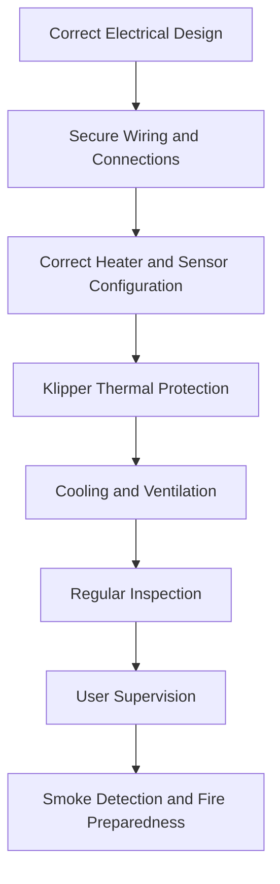

# Fire & Environment Safety

The My-Cloner Rev A contains electrically powered heaters, high-current circuits, motors, fans and electronic components that may operate for many hours during a print.

As with any electrically powered machine that generates heat, fire risk cannot be treated as zero.

Safe operation depends on:

- Correct electrical construction
- Reliable temperature monitoring
- Active firmware safety protections
- Adequate cooling
- Secure electrical connections
- A suitable operating environment
- Regular inspection
- Appropriate supervision
- Immediate investigation of abnormal behaviour

This page describes practical measures that reduce the risk of fire and help create a safer operating environment.

---

## Fire Prevention Starts with the Installation

The printer should be installed in a location where a fault is less likely to develop into a larger fire.

Place the printer on a:

- Stable surface
- Non-flammable or fire-resistant surface where practical
- Clean work area
- Dry location
- Well-ventilated location
- Position with adequate clearance around the machine

Avoid operating the printer directly on or immediately next to:

- Paper
- Cardboard
- Curtains
- Upholstery
- Carpet
- Solvents
- Aerosols
- Fuel
- Flammable liquids
- Large quantities of filament packaging
- Other easily combustible materials

!!! important "Keep the Area Around the Printer Clear"
    Do not use the area around or underneath the printer as general storage.

    Keep combustible materials away from the printer, particularly from the power supply, electronics, heated bed and hotend area.

---

## Choose the Printer Location Carefully

The printer should not be installed where a developing fault could remain unnoticed for a long time.

Whenever possible:

- Keep the printer in an occupied or regularly monitored area
- Avoid placing it inside confined furniture without adequate ventilation
- Avoid locations where smoke could remain trapped
- Keep access to the printer unobstructed
- Maintain a clear path to the room exit
- Keep the mains disconnect accessible

Do not position the printer so that reaching the power plug would require passing through the immediate area of a possible fire.

---

## Smoke Detection

A working smoke detector should be present in or near the area where the printer is operated.

The detector should:

- Be appropriate for the room
- Be installed according to the manufacturer's instructions
- Be tested regularly
- Have its battery or backup supply maintained where applicable

A smoke detector does not replace supervision or proper printer maintenance.

Its purpose is to provide an additional warning if a fault develops despite other precautions.

!!! important "Early Detection Matters"
    Electrical faults may initially produce heat, smell or smoke before visible flames appear.

    Investigate unusual smells, discoloration or smoke immediately.

---

## Fire Extinguisher

A suitable fire extinguisher should be readily accessible in the general work area.

The extinguisher must be appropriate for the types of fire that may occur around electrical equipment and the materials present in the room.

Fire-extinguisher classifications vary between countries and regions.

Follow local fire-safety guidance when selecting an extinguisher.

!!! warning "Do Not Use Water on Energized Electrical Equipment"
    Water must not be used on electrical equipment while it remains energized.

    If a fire occurs, disconnect electrical power only if it is safe to do so.

The extinguisher should be positioned so that it can be reached without approaching or crossing the immediate fire area.

Do not place the only extinguisher directly beside the printer.

---

## If Fire Occurs

Personal safety has priority over the printer or any other equipment.

If smoke or fire develops:

1. Stop the printer if this can be done safely.
2. Disconnect mains power if the disconnect can be reached safely.
3. Move away from the machine if the situation is developing rapidly.
4. Warn other people in the area.
5. Use an appropriate fire extinguisher only if the fire is small, you are trained or confident in its use, and you have a safe escape route.
6. Contact the appropriate emergency services when required.

Do not attempt to fight a developing fire if doing so places you at risk.

!!! danger "Never Block Your Escape Route"
    If you attempt to use an extinguisher, always maintain a clear escape route behind you.

    Do not allow yourself to become trapped between the fire and the exit.

---

## Supervision

A printer that is:

- Being commissioned
- Running new firmware
- Using a new heater configuration
- Using a new thermistor configuration
- Testing sensorless homing
- Testing new wiring
- Using replaced electrical components
- Returning to operation after a repair

should remain under direct supervision.

The same applies after significant hardware modifications.

During ordinary printing, the printer should still be checked periodically.

!!! warning "Do Not Ignore an Operating Printer"
    Long print duration does not make the printer risk-free.

    Periodically check the machine, particularly during long prints.

Avoid leaving a newly commissioned or recently modified printer operating where developing problems would not be noticed.

---

## Thermal Protection

Klipper temperature monitoring and heater-safety mechanisms are an essential part of the My-Cloner safety architecture.

These protections must remain active.

!!! danger "Never Disable Thermal Protection"
    Do not disable temperature monitoring or heater-safety mechanisms to bypass a firmware error.

A heater error should be treated as a fault that requires investigation.

Possible causes include:

- Damaged thermistor wiring
- Incorrect thermistor configuration
- Loose heater wiring
- Heater failure
- Connector failure
- Excessive cooling
- Incorrect firmware limits
- Intermittent electrical connections

Repeatedly restarting after a thermal fault without identifying its cause may allow a hazardous condition to continue.

See [Electrical & Thermal Safety](electrical-and-thermal-safety.md).

---

## Temperature Sensors

The hotend and heated bed rely on temperature sensors for closed-loop control.

Before heating, the reported temperatures should be plausible for the surrounding environment.

Stop and investigate if you observe:

- Unrealistic cold temperatures
- Unrealistic high temperatures
- Sudden temperature jumps
- Large unexplained fluctuations
- Temperature that does not increase when heating begins
- Temperature that continues rising unexpectedly
- Repeated sensor errors

!!! danger "Do Not Heat with Invalid Temperature Feedback"
    Never intentionally operate a heater when its associated temperature sensor is disconnected, unreliable or incorrectly configured.

---

## Heater Connections

The hotend heater and heated bed are significant electrical loads.

Poor electrical connections can generate heat independently of the heater itself.

Periodically inspect accessible heater connections for:

- Loose terminals
- Darkened connectors
- Melted plastic
- Damaged insulation
- Brittle insulation
- Discoloration
- Unusual smell
- Signs of excessive heat

If a connector becomes unusually hot during operation, stop using the printer and investigate the cause.

Do not continue printing with a connection that shows signs of overheating.

---

## Power Connections

High-resistance power connections are a potential heat source.

The main power path should remain mechanically secure and electrically sound.

Stop using the printer if you observe:

- Loose power terminals
- Loose IEC connections
- Intermittent power
- Arcing
- Sparks
- Connector discoloration
- Melted connector housings
- Hot power cables
- Burning smell

Never repeatedly tighten, reconnect or replace mains wiring while the machine remains connected to the mains supply.

For the Rev A electrical architecture, see [Power Distribution](../wiring/power-distribution.md).

---

## Do Not Overload the Mains Connection

The printer should be connected to a suitable mains outlet and electrical installation.

Avoid:

- Damaged extension cables
- Underrated extension cables
- Overloaded power strips
- Multiple power strips connected together
- Loose wall outlets
- Damaged plugs
- Improvised mains adapters
- Unverified smart plugs or switching devices not rated for the printer load

Where an extension cable or switched outlet is used, it must be rated appropriately for the electrical load and local mains supply.

A loose or poor-quality mains connection can become a source of heat.

---

## Protective Devices

Electrical protective devices should not be bypassed.

These may include:

- IEC inlet fuse
- Mains circuit protection
- Residual-current protection where provided by the building installation
- Power-supply protection
- Firmware heater protections

Do not replace a fuse with:

- A higher current rating without validating the electrical design
- Wire
- Foil
- A permanently bridged connection

!!! danger "Never Bypass a Fuse"
    A fuse is a protective device.

    If a fuse repeatedly opens, identify the electrical fault rather than installing a larger fuse.

---

## Power Supply Ventilation

The Mean Well LRS-350-24 requires adequate ventilation.

Do not:

- Cover the power supply
- Block its ventilation openings
- Surround it with loose material
- Allow dust or debris to accumulate excessively
- Store filament packaging, paper or cloth against it

The power supply should have sufficient surrounding airflow to dissipate heat.

Unusual PSU temperature, smell, noise or visible damage should be investigated before continued use.

---

## Electronics Cooling

The controller board, stepper drivers and power electronics also generate heat.

Ensure that:

- Cooling paths remain unobstructed
- Fans required by the design operate correctly
- Dust accumulation does not block airflow
- Wires cannot enter fan blades
- Loose objects cannot fall onto exposed electronics

Do not intentionally block ventilation to reduce fan noise.

---

## Hotend Cooling Fan

The hotend cooling fan is part of the thermal system.

Loss of hotend heatsink cooling can produce excessive heat in areas not intended to operate at extrusion temperature.

Before and during printing, verify that required hotend cooling is operating normally.

!!! important "Failed Hotend Cooling"
    If the hotend cooling fan stops while the hotend is at printing temperature, stop the print and allow the hotend to cool before investigating.

Do not continue printing simply because extrusion still appears possible.

---

## Keep Flammable Liquids Away

Common workshop products may be flammable.

Examples include:

- Isopropyl alcohol
- Acetone
- Solvent cleaners
- Aerosol products
- Some adhesives

Keep these products:

- Away from the hotend
- Away from the heated bed
- Away from sparks
- Away from electrical terminals
- Away from the power supply
- Away from open flames

Close containers immediately after use.

Do not store large quantities of flammable liquids beside the printer.

---

## Cleaning with Isopropyl Alcohol

Isopropyl alcohol may be used for cleaning the print surface.

If IPA is used:

1. Apply it only to a cool surface.
2. Keep it away from the hotend and other hot components.
3. Keep the container closed when not in use.
4. Allow the alcohol to evaporate before heating the bed.
5. Provide adequate ventilation.
6. Keep contaminated cloths or wipes away from heat and ignition sources.

!!! warning "Do Not Apply Solvent to a Hot Bed"
    Do not apply isopropyl alcohol or another flammable solvent to a hot build surface.

---

## Filament and Printing Materials

Heating thermoplastic filament can produce:

- Odours
- Ultrafine particles
- Volatile compounds

The quantity and composition depend on the material, temperature and printing conditions.

Operate the printer in a ventilated environment.

Follow the filament manufacturer's safety information, particularly when printing materials such as:

- ABS
- ASA
- Nylon
- Polycarbonate
- Engineering materials
- Filled or composite materials

Do not assume that all filaments have the same emissions or temperature requirements.

---

## Ventilation

General room ventilation is recommended during printing.

Additional extraction or enclosure ventilation may be appropriate depending on:

- Filament material
- Printing temperature
- Printing duration
- Room size
- Frequency of use

Ventilation arrangements must not introduce unsafe airflow around electrical components or create a new fire hazard.

Do not route hot exhaust air toward combustible materials.

---

## Dust and Debris

Keep the printer and surrounding area reasonably clean.

Accumulated material can:

- Restrict airflow
- Enter cooling fans
- Accumulate around electronics
- Hide damaged wiring
- Increase combustible material near heat sources

Periodically remove:

- Filament fragments
- Dust
- Failed-print debris
- Paper
- Packaging
- Loose cable ties
- Other workshop waste

The area beneath the printer should also remain clear.

---

## Failed Prints

A failed print can create conditions that require intervention.

Examples include:

- Printed material accumulating around the hotend
- A detached print being dragged across the bed
- Filament forming a large mass around the heater block
- Motion being obstructed
- Cables being pulled or trapped

Do not allow a severe failed print to continue indefinitely.

Stop the printer if the failure begins to interfere with the hotend, wiring, motion system or cooling.

---

## Long Prints

Some prints may operate continuously for many hours.

Before starting a long print:

- Inspect the printer
- Check the print surface
- Confirm normal fan operation
- Check temperature readings
- Check visible power and heater connections
- Remove combustible clutter around the printer
- Confirm the smoke detector is operational
- Ensure appropriate fire-response equipment is accessible

A long print should not be used as the first test after a significant electrical, heater or firmware modification.

---

## After Modifications or Repairs

Fire-related risk should be reassessed after changes to:

- Main power wiring
- Power supply
- Fuse
- Controller board
- Heater wiring
- Heated bed
- Hotend heater
- Thermistors
- Cooling fans
- Connectors
- Klipper heater configuration
- Thermal limits

The affected subsystem should be validated before the machine returns to extended printing.

Initial testing after such changes should remain directly supervised.

---

## Signs That Require Immediate Attention

Stop the machine and investigate immediately if you detect:

- Smoke
- Sparks
- Burning smell
- Melting insulation
- Darkened electrical connectors
- Unexpectedly hot cables
- Unexpectedly hot connectors
- Repeated blown fuses
- Repeated power resets
- Uncontrolled heater behaviour
- Abnormal temperature readings
- Failed cooling fans
- Electrical crackling or arcing sounds
- Visible damage to the power supply
- Components becoming hotter than expected

!!! danger "Do Not Continue Printing Through a Warning Sign"
    An intermittent fault can still be dangerous.

    Do not continue operating the printer simply because the problem disappears after a restart.

---

## Recommended Fire-Safety Checklist

Before normal use, confirm that:

- [ ] The printer is on a stable and suitable surface.
- [ ] Combustible materials are not stored around the printer.
- [ ] The operating area is reasonably clean.
- [ ] Mains and power cables show no visible damage.
- [ ] No connector shows signs of overheating.
- [ ] Cooling paths are unobstructed.
- [ ] The hotend cooling fan operates correctly.
- [ ] Temperature readings appear plausible.
- [ ] Klipper thermal protection is enabled.
- [ ] The printer is not reporting heater or sensor faults.
- [ ] The smoke detector in or near the work area is operational.
- [ ] Suitable fire-response equipment is accessible.
- [ ] The mains disconnect can be reached safely.
- [ ] The printer will be appropriately supervised for its current validation state.

---

## My-Cloner Safety Philosophy

The My-Cloner project should never rely on a single safety mechanism.

Fire prevention should use multiple independent layers:

No single layer should be treated as a substitute for the others.

A correctly configured firmware safety system does not replace good wiring.

Good wiring does not replace temperature monitoring.

Temperature monitoring does not replace inspection and supervision.

The goal is to prevent a single failure from developing into a dangerous event.

---

## Related Documentation

- [Safe Usage Guidelines](safe-usage.md) — general operating precautions and supervision
- [Electrical & Thermal Safety](electrical-and-thermal-safety.md) — electrical hazards, heaters and temperature monitoring
- [Power Distribution](../wiring/power-distribution.md) — mains, 24 V and 5 V electrical architecture
- [Heaters & Temperature Sensors](../wiring/heaters-and-temperature-sensors.md) — heater and thermistor architecture
- [Fans](../wiring/fans.md) — cooling systems and fan assignments
- [Before First Power-On](../operation/initial-setup/before-first-power-on.md) — pre-power commissioning inspection
- [First Power-On](../operation/initial-setup/first-power-on.md) — controlled initial power-up procedure