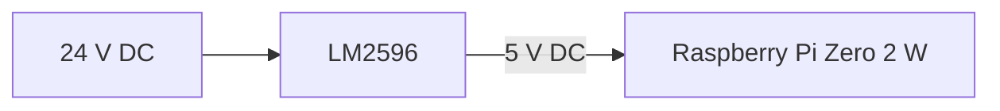

# MKS Robin Nano V3 Controller Board

The **MKS Robin Nano V3** is the main controller board used by the **My-Cloner Rev A**.

It controls the printer's:

- Stepper motors
- Stepper drivers
- Hotend heater
- Heated bed
- Temperature sensors
- Cooling fans
- Probe and auxiliary sensors
- Display interfaces

The board communicates with the Raspberry Pi Zero 2 W running Klipper.

!!! info "My-Cloner Rev A"
    The My-Cloner Rev A uses the MKS Robin Nano V3 with a **24 V DC system supply** and **5 × TMC2209 stepper drivers**.

    The Raspberry Pi Zero 2 W is powered separately through a 24 V → 5 V LM2596 converter.

---

## Official References

The information on this page is based on the official Makerbase and Klipper project files.

- [MKS Robin Nano V3.X — Makerbase GitHub](https://github.com/makerbase-mks/MKS-Robin-Nano-V3.X){ target="_blank" rel="noopener noreferrer" }
- [Klipper — Generic MKS Robin Nano V3 Configuration](https://github.com/Klipper3d/klipper/blob/master/config/generic-mks-robin-nano-v3.cfg){ target="_blank" rel="noopener noreferrer" }
- [Klipper — TMC Driver Documentation](https://github.com/Klipper3d/klipper/blob/master/docs/TMC_Drivers.md){ target="_blank" rel="noopener noreferrer" }

The official Makerbase schematic identifies the board as **MKS Robin Nano V3**, hardware revision **V3.0_004**, using an **STM32F407VGT6** microcontroller.

---

## Main Controller

| Item | Specification |
|---|---|
| Controller | MKS Robin Nano V3 |
| MCU | STM32F407VGT6 |
| Firmware | Klipper |
| My-Cloner system voltage | 24 V DC |
| Stepper driver positions | 5 |
| Driver positions | X, Y, Z, E0, E1 |
| My-Cloner drivers | TMC2209 |
| Driver communication | UART |
| Host | Raspberry Pi Zero 2 W |
| Host communication | USB |
| Primary UI | Mainsail |

The board-level schematic separates the controller into functional blocks for:

- MCU
- Power
- MOSFET outputs
- Thermistors
- Endstops and sensor inputs
- Stepper drivers
- USB
- SD card
- Display / auxiliary connections

---

## Stepper Driver Interfaces

The Robin Nano V3 provides five replaceable stepper-driver positions:

| Driver Position | My-Cloner Rev A Assignment |
|---|---|
| X | X Axis |
| Y | Y Axis |
| Z | Left Z Axis |
| E0 | Extruder |
| E1 | Right Z Axis |

The My-Cloner Rev A uses **TMC2209 drivers in UART mode**.

!!! note "Rev A Assignment"
    Using the E1 driver for the second Z motor is a My-Cloner-specific assignment.

    It must be physically validated during machine bring-up.

### STEP / DIR / ENABLE Pins

| Driver | STEP | DIR | ENABLE |
|---|---:|---:|---:|
| X | `PE3` | `PE2` | `PE4` |
| Y | `PE0` | `PB9` | `PE1` |
| Z | `PB5` | `PB4` | `PB8` |
| E0 | `PD6` | `PD3` | `PB3` |
| E1 | `PD15` | `PA1` | `PA3` |

The official Klipper generic configuration confirms the X, Y, Z and E0 mappings above and provides the E1 interface as an additional driver channel.

The final Klipper configuration may use the `!` prefix to invert the direction or enable signal where required.

---

## TMC2209 UART

The Robin Nano V3 provides dedicated UART signals for the five stepper-driver positions.

| Driver | UART Pin |
|---|---:|
| X | `PD5` |
| Y | `PD7` |
| Z | `PD4` |
| E0 | `PD9` |
| E1 | `PD8` |

These pins will be used by the corresponding Klipper `[tmc2209 ...]` sections.

Example:

    [tmc2209 stepper_x]
    uart_pin: PD5

!!! warning "Driver Configuration"
    The UART pin identifies the board connection only.

    Motor current, StallGuard threshold and other TMC2209 parameters must be configured for the actual My-Cloner motors and validated on the physical machine.

---

## DIAG and Endstop Interfaces

The Robin Nano V3 provides DIAG routing for compatible TMC drivers.

The official board schematic maps the available driver DIAG signals to endstop inputs.

| Driver | DIAG / Endstop Input | MCU Pin |
|---|---|---:|
| X | X- | `PA15` |
| Y | Y- | `PD2` |
| Z | Z- | `PC8` |
| E0 | Z+ | `PC4` |
| E1 | E1- | `PE7` |

For the My-Cloner Rev A:

- X uses TMC2209 sensorless homing
- Y uses TMC2209 sensorless homing
- Z uses the P.I.N.D.A. probe

The X/Y sensorless homing configuration requires physical tuning and is not considered validated until it has been tested on the machine.

---

## Heater Outputs

The board provides separate MOSFET-controlled outputs for the hotend, heated bed and an additional heater channel.

The official schematic exposes `HEATER1`, `HEATER2` and `HOTBED` outputs.

| Board Output | MCU Pin | My-Cloner Rev A |
|---|---:|---|
| HE0 | `PE5` | Hotend Heater |
| HE1 | `PB0` | Not currently used |
| H-BED | `PA0` | Heated Bed |

The generic Klipper configuration confirms `PE5` for the primary hotend heater and `PA0` for the heated bed.

!!! warning "24 V System"
    The My-Cloner Rev A uses 24 V heaters.

    Always verify heater voltage and wiring before power is applied.

---

## Temperature Sensor Inputs

The Robin Nano V3 provides three thermistor inputs.

The Makerbase schematic identifies:

- `TH1`
- `TH2`
- `TB`

| Input | MCU Pin | My-Cloner Rev A |
|---|---:|---|
| TH1 | `PC1` | Hotend Thermistor |
| TH2 | `PA2` | Available |
| TB | `PC0` | Heated Bed Thermistor |

The generic Klipper configuration uses:

    Hotend: PC1
    Heated Bed: PC0

!!! important "Thermistor Type"
    The MCU input pin and the Klipper `sensor_type` are separate settings.

    The exact thermistor model installed on the machine must be confirmed before the final firmware configuration is released.

---

## Fan Outputs

The Robin Nano V3 provides two controllable fan outputs.

| Output | MCU Pin | My-Cloner Assignment |
|---|---:|---|
| FAN1 | `PC14` | Pending assignment |
| FAN2 | `PB1` | Pending assignment |

The My-Cloner Rev A uses:

- 4010 24 V hotend cooling fan
- 5015 24 V part-cooling blower

The final FAN1/FAN2 assignment will be confirmed during electrical wiring and physical validation.

The official Klipper generic configuration uses `PC14` as its example `[fan]` output and lists `PB1` as the second fan output.

---

## Probe and Auxiliary Inputs

The Robin Nano V3 exposes several inputs that may be used by probes and auxiliary sensors.

| Function | MCU Pin | My-Cloner Status |
|---|---:|---|
| X Endstop / X DIAG | `PA15` | X sensorless homing |
| Y Endstop / Y DIAG | `PD2` | Y sensorless homing |
| Z Endstop / Z DIAG | `PC8` | Available |
| Z+ / E0 DIAG | `PC4` | Available |
| E1 DIAG | `PE7` | Available |
| Material Detect 1 | `PA4` | Candidate filament sensor input |
| Material Detect 2 | `PE6` | Available |
| Power Detect | `PA13` | Not currently implemented |
| Power Off | `PB2` | Not currently implemented |
| BLTouch Control | `PA8` | Not currently assigned |

!!! important "P.I.N.D.A. Probe"
    The My-Cloner uses a **P.I.N.D.A. probe**, not a BLTouch.

    The final P.I.N.D.A. signal connection will be defined from the My-Cloner wiring schematic and physically validated.

    The BLTouch control pin must not automatically be treated as the P.I.N.D.A. input.

---

## Filament Sensor

The My-Cloner Rev A uses an **MK3-style IR filament sensor**.

The Robin Nano V3 provides two material-detection inputs:

| Input | MCU Pin |
|---|---:|
| MT_DET1 | `PA4` |
| MT_DET2 | `PE6` |

The final My-Cloner assignment will be defined in the electrical schematic and validated on the physical printer.

---

## EXP1 / EXP2 Headers

The board provides two display / auxiliary headers.

### EXP1

| Header Pin | MCU / Signal |
|---|---|
| EXP1_1 | `PC5` |
| EXP1_2 | `PE13` |
| EXP1_3 | `PD13` |
| EXP1_4 | `PC6` |
| EXP1_5 | `PE14` |
| EXP1_6 | `PE15` |
| EXP1_7 | `PD11` |
| EXP1_8 | `PD10` |
| EXP1_9 | GND |
| EXP1_10 | 5 V |

### EXP2

| Header Pin | MCU / Signal |
|---|---|
| EXP2_1 | `PA6` |
| EXP2_2 | `PA5` |
| EXP2_3 | `PE8` |
| EXP2_4 | `PE10` |
| EXP2_5 | `PE11` |
| EXP2_6 | `PA7` |
| EXP2_7 | `PE12` |
| EXP2_8 | RESET |
| EXP2_9 | GND |
| EXP2_10 | 3.3 V |

These mappings are also defined by the official Klipper board aliases.

The MKS TS35 V2.0 integration with the final Klipper system is still under validation.

**Mainsail remains the primary user interface for the My-Cloner Rev A.**

---

## USB Communication

The My-Cloner uses USB communication between:

The official Klipper generic configuration specifies:

- MCU: `STM32F407`
- Bootloader: `48KiB`
- Communication: `USB`

It also notes that the normal `make flash` procedure is not used for this board. Instead, the compiled Klipper binary is renamed to:

    Robin_nano_v3.bin

and flashed using an SD card.

!!! note "Firmware Installation"
    The complete firmware compilation and flashing procedure will be documented separately in the Firmware Configuration section.

---

## Board Power

The official Makerbase pin map identifies the Robin Nano V3 main supply as **12/24 V compatible**.

The My-Cloner Rev A operates exclusively from:

**24 V DC**

The controller receives its 24 V supply from the Mean Well LRS-350-24.

The Raspberry Pi is **not powered directly from the mainboard** in the current My-Cloner architecture.

Instead:

---

## My-Cloner Usage Summary

| Board Function | My-Cloner Rev A |
|---|---|
| X Driver | X Axis TMC2209 |
| Y Driver | Y Axis TMC2209 |
| Z Driver | Left Z TMC2209 |
| E0 Driver | Extruder TMC2209 |
| E1 Driver | Right Z TMC2209 |
| HE0 | 24 V Hotend Heater |
| HE1 | Unused |
| H-BED | 24 V Heated Bed |
| TH1 | Hotend Thermistor |
| TH2 | Available |
| TB | Heated Bed Thermistor |
| FAN1 | Assignment pending validation |
| FAN2 | Assignment pending validation |
| X- | X Sensorless Homing |
| Y- | Y Sensorless Homing |
| P.I.N.D.A. | Final input pending validation |
| MT_DET | IR Filament Sensor — final input pending validation |
| EXP / Display | TS35 V2.0 — integration under validation |
| USB | Raspberry Pi / Klipper communication |

---

## Related Documentation

For the complete My-Cloner-specific mapping:

[I/O Map](io-map.md)

For motor and homing configuration:

[Motors & Homing](motors-and-homing.md)

For heater and sensor connections:

[Heaters & Temperature Sensors](heaters-and-temperature-sensors.md)

For power wiring:

[Power Distribution](power-distribution.md)

For the future Klipper configuration:

[Firmware Configuration](../downloads/firmware-configuration.md)