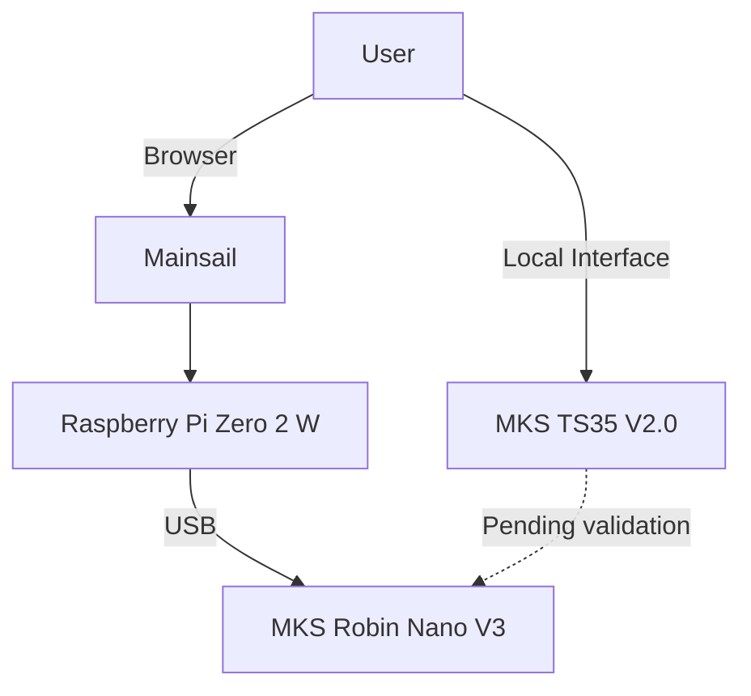
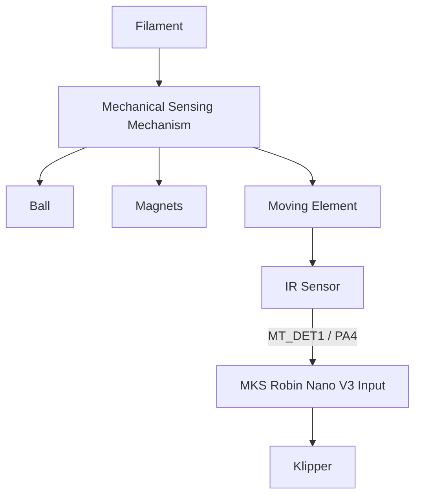

# My-Cloner Rev A — Display & Filament Sensor

See [Owner-Reported Hardware and Test Status](io-map.md#owner-reported-hardware-and-test-status) for the confirmed V3.0 hardware, connections and remaining checks.

This page documents the local display and filament-detection hardware used by the **My-Cloner Rev A**.

The current hardware configuration includes:

- MKS TS35 V2.0 display
- MK3-style IR V0.4 filament sensor
- MKS Robin Nano V3 controller
- Raspberry Pi Zero 2 W running Klipper and Mainsail

!!! info "Primary User Interface"
    **Mainsail is the primary user interface for the My-Cloner Rev A.**

    The MKS TS35 V2.0 is included in the hardware configuration, but its final integration with the Klipper-based system is still under validation.

---

## Official References

The MKS Robin Nano V3 connector and MCU mappings documented on this page are based on the official Makerbase and Klipper project files.

- [MKS Robin Nano V3.X — Makerbase GitHub](https://github.com/makerbase-mks/MKS-Robin-Nano-V3.X){ target="_blank" rel="noopener noreferrer" }
- [Klipper — Generic MKS Robin Nano V3 Configuration](https://github.com/Klipper3d/klipper/blob/master/config/generic-mks-robin-nano-v3.cfg){ target="_blank" rel="noopener noreferrer" }

---

## Display Architecture

The My-Cloner Rev A includes an:

**MKS TS35 V2.0**

The final operating mode of the display within the Klipper architecture is pending validation.

The overall system architecture is:



The Raspberry Pi Zero 2 W remains responsible for:

- Klipper host processing
- Mainsail
- Network access
- High-level printer control

The MKS Robin Nano V3 remains responsible for real-time printer hardware control.

---

## MKS TS35 V2.0

The MKS TS35 V2.0 is part of the planned My-Cloner Rev A hardware configuration.

| Item | Specification |
|---|---|
| Display | MKS TS35 V2.0 |
| Controller | MKS Robin Nano V3 |
| Firmware environment | Klipper |
| Primary interface | Mainsail |
| Local-display integration | Pending validation |

!!! warning "Display Integration Pending Validation"
    The presence of compatible physical connectors does not automatically confirm full TS35 operation under Klipper.

    The final connection method, operating mode and software integration must be validated before the display configuration is published.

---

## Robin Nano Display Interfaces

The MKS Robin Nano V3 provides EXP1 and EXP2 headers that expose display and auxiliary signals.

These connectors may be used by compatible display hardware.

### EXP1

| Pin | MCU / Signal |
|---|---|
| EXP1_1 | `PC5` |
| EXP1_2 | `PE13` |
| EXP1_3 | `PD13` |
| EXP1_4 | `PC6` |
| EXP1_5 | `PE14` |
| EXP1_6 | `PE15` |
| EXP1_7 | `PD11` |
| EXP1_8 | `PD10` |
| EXP1_9 | GND |
| EXP1_10 | 5 V |

### EXP2

| Pin | MCU / Signal |
|---|---|
| EXP2_1 | `PA6` |
| EXP2_2 | `PA5` |
| EXP2_3 | `PE8` |
| EXP2_4 | `PE10` |
| EXP2_5 | `PE11` |
| EXP2_6 | `PA7` |
| EXP2_7 | `PE12` |
| EXP2_8 | RESET |
| EXP2_9 | GND |
| EXP2_10 | 3.3 V |

These mappings are also exposed as board aliases in the official generic Klipper configuration for the MKS Robin Nano V3.

---

## Display Validation

The TS35 should be validated independently from the basic printer bring-up.

Recommended sequence:

1. Bring up the MKS Robin Nano V3 without relying on the display.
2. Confirm Raspberry Pi communication with the controller.
3. Confirm Klipper operation.
4. Confirm Mainsail operation.
5. Verify the TS35 power requirements.
6. Verify the intended physical interface.
7. Confirm connector orientation.
8. Connect the display only after the interface has been verified.
9. Test the intended operating mode.
10. Document the final connection and software configuration.

!!! important "Printer Must Not Depend on the Display"
    The basic My-Cloner Rev A should remain controllable through Mainsail even if the local display is disconnected or unavailable.

---

## Filament Sensor

The My-Cloner Rev A uses a **MK3-style IR V0.4 filament sensor**.

The mechanical sensing system uses:

- An infrared sensor
- A mechanical ball
- Magnets
- A moving mechanism activated by the filament

The purpose of the system is to determine whether filament is present in the extruder path.

---

## Filament Detection Principle

The mechanical system converts filament movement or presence into a detectable state for the IR sensor.

Conceptually:



The owner reports MT_DET1 / PA4 as the installed connection. Electrical behaviour remains pending validation.

---

## Robin Nano Material-Detection Inputs

The MKS Robin Nano V3 provides two material-detection inputs.

| Board Signal | MCU Pin | My-Cloner Rev A |
|---|---:|---|
| MT_DET1 | `PA4` | IR V0.4 filament sensor |
| MT_DET2 | `PE6` | Available / alternative input |

The owner reports MT_DET1 / PA4 as the installed connection.

!!! note "Rev A Assignment"
    IR V0.4 is connected to MT_DET1 / PA4. Supply voltage, signal polarity and runout behaviour remain pending validation. See the [I/O Map](io-map.md).

---

## Filament Sensor Electrical Interface

Before connecting the IR sensor, the following must be confirmed:

- Sensor supply voltage
- Ground connection
- Signal voltage
- Signal polarity
- Robin Nano input used
- Logic state with filament present
- Logic state with filament absent

Do not assume the sensor output polarity from another printer configuration.

---

## Klipper Integration

The filament sensor can be represented in Klipper using a filament-sensor section once the electrical behaviour has been confirmed.

A possible configuration structure is:

```ini
[filament_switch_sensor filament_sensor]
switch_pin: <PA4_WITH_VERIFIED_PREFIXES>
pause_on_runout: True
```

The assigned MCU input is PA4. Its required signal inversion and pull-up setting remain pending validation.

!!! warning "Example Only"
    Do not copy the placeholder configuration into the final `printer.cfg`.

    The correct input and signal inversion must be determined from the installed sensor.

---

## Sensor State Validation

The filament sensor should be tested before enabling automatic runout actions.

Recommended procedure:

1. Power the controller safely.
2. Confirm the sensor supply voltage.
3. Read the raw input state without filament.
4. Insert filament.
5. Confirm that the input state changes.
6. Remove filament.
7. Confirm that the original state returns.
8. Repeat several times.
9. Confirm reliable mechanical movement.
10. Only then enable automatic runout behaviour.

The sensor should reliably distinguish between:

- Filament present
- Filament absent

---

## Mechanical Validation

Because the filament sensor includes a mechanical sensing mechanism, electrical validation alone is not sufficient.

Check:

- Free movement of the ball
- Correct magnet orientation
- Reliable mechanical return
- No binding
- Correct response to filament insertion
- Correct response to filament removal
- Repeatability

The mechanism should return to the same state after repeated filament insertion and removal.

---

## Runout Behaviour

The final Klipper behaviour for filament runout will be defined after the sensor has been validated.

Possible behaviour includes:

- Pause the print
- Retract or park the toolhead
- Notify the user
- Allow filament replacement
- Resume the print

The final behaviour will be defined in the My-Cloner firmware configuration and operating documentation.

---

## Troubleshooting Considerations

### Sensor Does Not Change State

Check:

- Sensor supply voltage
- Signal wiring
- Ground
- Mechanical movement
- Ball position
- Magnet orientation
- Selected MCU pin

### State Is Reversed

The sensor may be electrically active-low or active-high.

Klipper allows signal inversion using the `!` prefix where appropriate.

The required polarity must be confirmed from the physical sensor.

### Intermittent Detection

Check:

- Connector quality
- Cable movement
- Mechanical friction
- Sensor alignment
- Loose components
- Electrical noise

Do not compensate for a mechanical fault purely through firmware.

---

## Validation Status

See [Status Definitions](io-map.md#status-definitions). Design assignments and source mappings do not establish physical validation.

| Item | Status |
|---|---|
| MKS TS35 V2.0 hardware | Rev A assignment |
| Mainsail primary interface | Rev A assignment |
| Robin Nano EXP1 mapping | Source confirmed |
| Robin Nano EXP2 mapping | Source confirmed |
| TS35 physical interface | Pending validation |
| TS35 Klipper integration | Pending validation |
| IR filament sensor type | Rev A assignment |
| MT_DET1 pin | Source confirmed — `PA4` |
| MT_DET2 pin | Source confirmed — `PE6` |
| Filament-sensor input — MT_DET1 / PA4 | Rev A assignment |
| Sensor supply voltage | Pending validation |
| Sensor signal polarity | Pending validation |
| Filament-present state | Pending validation |
| Filament-absent state | Pending validation |
| Klipper runout behaviour | Planned |
| Mechanical repeatability | Pending validation |

---

## Related Documentation

- [I/O Map](io-map.md) — complete display and filament-sensor signal mapping
- [Controller Board](controller-board.md) — EXP headers and material-detection inputs
- [System Overview](system-overview.md) — overall My-Cloner Rev A control architecture
- [Firmware Configuration](../downloads/firmware-configuration.md) — planned Klipper integration
- [Loading and Unloading Filament](../operation/initial-setup/loading-unloading-filament.md) — filament handling procedure