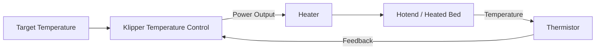

# My-Cloner Rev A — Heaters & Temperature Sensors

This page documents the heating and temperature-sensing architecture used by the **My-Cloner Rev A**.

The printer uses:

- 1 × 24 V hotend heater
- 1 × 24 V heated bed
- 1 × hotend thermistor
- 1 × heated-bed thermistor

The MKS Robin Nano V3 controls both heaters and reads both temperature sensors.

!!! warning "Thermistor Models Not Yet Final"
    The electrical input pins are known.

    The exact thermistor models installed on the My-Cloner Rev A still require final confirmation.

    The Klipper `sensor_type` must match the actual installed sensor.

---

## Official References

The board-level pin mappings on this page are based on the official Makerbase schematic and the official Klipper configuration for the MKS Robin Nano V3.

- [MKS Robin Nano V3.X — Makerbase GitHub](https://github.com/makerbase-mks/MKS-Robin-Nano-V3.X){ target="_blank" rel="noopener noreferrer" }
- [Klipper — Generic MKS Robin Nano V3 Configuration](https://github.com/Klipper3d/klipper/blob/master/config/generic-mks-robin-nano-v3.cfg){ target="_blank" rel="noopener noreferrer" }

The official Makerbase schematic provides separate heater outputs and thermistor inputs for the controller.

---

## Hotend

The My-Cloner Rev A uses two heating systems:

| Function | Voltage | Board Output | MCU Pin |
|---|---:|---|---:|
| Hotend Heater | 24 V DC | HE0 | `PE5` |
| Heated Bed | 24 V DC | H-BED | `PA0` |

The generic Klipper configuration for the Robin Nano V3 uses the same MCU pins for the primary hotend heater and heated bed.

---

### Hotend Heater

The My-Cloner Rev A uses a **V6-style hotend** with a **24 V heater cartridge**.

| Item | Specification |
|---|---|
| Heater type | V6-style heater cartridge |
| Voltage | 24 V DC |
| Board output | HE0 |
| MCU pin | `PE5` |
| Heater power | TBD |
| Maximum documented hotend temperature | 300 °C |

The heater output is controlled by the Robin Nano V3 MOSFET stage.

Example Klipper structure:

    [extruder]
    heater_pin: PE5

!!! warning "Heater Power"
    The exact heater-cartridge power must be confirmed before the final Rev A firmware and safety limits are released.

---

### Hotend Thermistor

The primary hotend thermistor input on the Robin Nano V3 is:

| Function | Board Input | MCU Pin |
|---|---|---:|
| Hotend Thermistor | TH1 | `PC1` |

The generic Klipper configuration uses:

    sensor_pin: PC1

The generic example configuration uses:

    sensor_type: ATC Semitec 104GT-2

However, this value belongs to the generic Klipper example and must **not automatically be treated as the My-Cloner Rev A thermistor specification**.

!!! important "Sensor Type Must Match Hardware"
    The My-Cloner Rev A hotend thermistor model is still pending confirmation.

    The final Klipper `sensor_type` must match the actual thermistor installed in the V6-style hotend.

---

## Heated Bed

The My-Cloner Rev A uses a:

**230 × 230 mm, 24 V DC heated bed**

| Item | Specification |
|---|---|
| Bed size | 230 × 230 mm |
| Voltage | 24 V DC |
| Board output | H-BED |
| MCU pin | `PA0` |
| Heater power | TBD |

The generic Klipper configuration uses:

    [heater_bed]
    heater_pin: PA0

!!! warning "High-Current Load"
    The heated bed is one of the highest-current devices in the printer.

    Wiring, connectors and terminal preparation must be suitable for the final measured or specified current.

---

### Heated-Bed Thermistor

The heated-bed thermistor uses the Robin Nano V3 bed-temperature input:

| Function | Board Input | MCU Pin |
|---|---|---:|
| Heated-Bed Thermistor | TB | `PC0` |

The generic Klipper configuration uses:

    sensor_pin: PC0

and provides the example:

    sensor_type: EPCOS 100K B57560G104F

As with the hotend sensor, the exact sensor fitted to the My-Cloner heated bed must be confirmed before the final firmware configuration is released.

---

## Additional Thermistor Input

The Robin Nano V3 also provides an additional thermistor input:

| Input | MCU Pin | My-Cloner Rev A |
|---|---:|---|
| TH2 | `PA2` | Available / currently unused |

This input may remain available for future expansion.

---

## Temperature Control

Klipper controls the hotend and bed temperatures using feedback from their respective thermistors.

The general control loop is:

The heater is switched as required to maintain the requested temperature.

---

### PID Control

The official generic Klipper configuration contains example PID values for the hotend and bed.

These values are **not final My-Cloner values**.

The final Rev A configuration should use PID values obtained from the actual machine.

Typical calibration commands include:

    PID_CALIBRATE HEATER=extruder TARGET=<temperature>

and:

    PID_CALIBRATE HEATER=heater_bed TARGET=<temperature>

The resulting values should only be saved after successful testing.

!!! warning "Do Not Copy Generic PID Values"
    PID values depend on the actual heater, sensor, mechanical assembly, airflow and thermal environment.

    Always calibrate the physical My-Cloner Rev A.

---

### Thermal Protection

Klipper provides thermal monitoring and heater-safety mechanisms.

The final My-Cloner Rev A firmware configuration must define appropriate limits for:

- Minimum valid temperature
- Maximum allowed temperature
- Heating behaviour
- Sensor faults
- Heater verification

These values must match the actual hardware.

!!! danger "Never Disable Thermal Protection"
    Thermal protection is a critical safety feature.

    Do not disable temperature monitoring or heater-safety mechanisms to bypass configuration or hardware faults.

---

## Hotend Temperature Limits

The intended maximum hotend temperature for the My-Cloner Rev A is:

**300 °C**

The final firmware limit must only be set after confirming that all hotend components are suitable for that temperature, including:

- Thermistor
- Heater cartridge
- Heater block
- Heatbreak
- Wiring
- PTFE components, if present

The configured maximum temperature must not exceed the rating of the lowest-rated component.

---

## Bed Temperature Limits

The final maximum heated-bed temperature is not yet defined in the Rev A documentation.

It must be selected according to:

- Heated-bed specification
- Thermistor
- Adhesive or insulation materials
- Magnetic sheet system
- PEI surface
- Wiring
- Mechanical construction

This value will be validated during the physical Rev A bring-up process.

---

## Wiring Considerations

Heater and thermistor wiring should be kept clearly separated where practical.

Recommended considerations include:

- Use suitable wire gauge for heater loads
- Use secure high-current terminations
- Avoid mechanical strain on heater wires
- Route thermistor wiring away from high-current cables where practical
- Provide strain relief near moving assemblies
- Inspect connectors for signs of overheating
- Verify polarity where required by connected electronics

Thermistors themselves are resistive devices and generally do not require polarity, but their connection must match the intended board input.

---

## Pre-Power Checks

Before enabling either heater:

1. Confirm heater voltage rating.
2. Confirm board-output assignment.
3. Confirm thermistor connection.
4. Verify that Klipper reports a realistic ambient temperature.
5. Confirm that temperature readings are stable.
6. Check that the selected `sensor_type` matches the installed thermistor.
7. Verify heater wiring and connector integrity.
8. Ensure the correct heater is associated with the correct sensor.

!!! danger "Never Power an Unmonitored Heater"
    Do not enable a heater unless its associated temperature sensor is connected, configured and reporting correctly.

---

## First Heater Test

The first heater test should be performed conservatively.

Recommended procedure:

1. Start with the printer at room temperature.
2. Confirm that both sensors report approximately ambient temperature.
3. Apply a low temperature target.
4. Observe the correct temperature channel.
5. Confirm that the intended heater is warming.
6. Stop immediately if the wrong component heats.
7. Monitor the temperature response.
8. Confirm that heating stops when commanded.
9. Allow the component to cool.
10. Proceed to PID calibration only after basic operation is confirmed.

---

## Validation Status

| Item | Status |
|---|---|
| Hotend heater MCU pin | Source confirmed |
| Heated-bed MCU pin | Source confirmed |
| Hotend thermistor MCU pin | Source confirmed |
| Bed thermistor MCU pin | Source confirmed |
| Hotend voltage | Defined — 24 V |
| Heated-bed voltage | Defined — 24 V |
| Hotend thermistor model | Pending confirmation |
| Bed thermistor model | Pending confirmation |
| Hotend heater power | TBD |
| Heated-bed power | TBD |
| Hotend PID | Pending calibration |
| Heated-bed PID | Pending calibration |
| Hotend thermal limits | Pending final validation |
| Heated-bed thermal limits | Pending final validation |
| Physical heater tests | Pending |

---

## Related Documentation

For the complete board mapping:

[I/O Map](io-map.md)

For the controller:

[Controller Board](controller-board.md)

For electrical power:

[Power Distribution](power-distribution.md)

For cooling:

[Fans](fans.md)

For the future Klipper configuration:

[Firmware Configuration](../downloads/firmware-configuration.md)