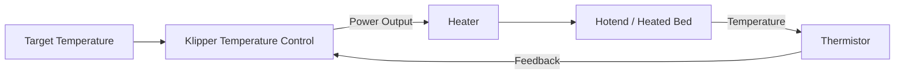

# My-Cloner Rev A — Heaters & Temperature Sensors

See [Owner-Reported Hardware and Test Status](io-map.md#owner-reported-hardware-and-test-status) for the confirmed V3.0 hardware, connections and remaining checks.

This page documents the heating and temperature-sensing architecture used by the **My-Cloner Rev A**.

The printer uses:

- 1 × 24 V hotend heater
- 1 × 24 V heated bed
- 1 × hotend thermistor
- 1 × heated-bed thermistor

The MKS Robin Nano V3 controls both heaters and reads both temperature sensors.

!!! warning "Temperature Validation Pending"
    The electrical input pins are known.

    The hotend sensor is owner-identified as ATC Semitec 104GT-2. The original Ender 3 bed sensor is NTC 100 kΩ; its exact curve remains TBD.

    The Klipper `sensor_type` must match the actual installed sensor.

---

## Official References

The board-level pin mappings on this page are based on the official Makerbase schematic and the official Klipper configuration for the MKS Robin Nano V3.

- [MKS Robin Nano V3.X — Makerbase GitHub](https://github.com/makerbase-mks/MKS-Robin-Nano-V3.X){ target="_blank" rel="noopener noreferrer" }
- [Klipper — Generic MKS Robin Nano V3 Configuration](https://github.com/Klipper3d/klipper/blob/master/config/generic-mks-robin-nano-v3.cfg){ target="_blank" rel="noopener noreferrer" }

The official Makerbase schematic provides separate heater outputs and thermistor inputs for the controller.

---

## Hotend

The My-Cloner Rev A uses two heating systems:

| Function | Voltage | Board Output | MCU Pin |
|---|---:|---|---:|
| Hotend Heater | 24 V DC | HE0 | `PE5` |
| Heated Bed | 24 V DC | H-BED | `PA0` |

The generic Klipper configuration for the MKS Robin Nano V3 uses the same MCU pins for the primary hotend heater and heated bed.

### Hotend Heater

The My-Cloner Rev A uses a **V6-style hotend** with a **24 V heater cartridge**.

| Item | Specification |
|---|---|
| Heater type | V6-style heater cartridge |
| Voltage | 24 V DC |
| Board output | HE0 |
| MCU pin | `PE5` |
| Heater power | 40 W — owner-reported specification |
| Intended hotend temperature target | 300 °C — Pending validation; operating limit TBD |

The heater output is controlled by the MKS Robin Nano V3 MOSFET stage.

Example Klipper structure:

```ini
[extruder]
heater_pin: PE5
```

!!! warning "Heater Power"
    The owner reports a 24 V, 40 W cartridge, Ø6 × 21 mm, and resistance checked against the expected 12–15 Ω range. Thermal limits and heater operation under the new configuration remain pending validation.

### Hotend Thermistor

The primary hotend thermistor input on the MKS Robin Nano V3 is:

| Function | Board Input | MCU Pin |
|---|---|---:|
| Hotend Thermistor | TH1 | `PC1` |

The generic Klipper configuration uses:

```ini
sensor_pin: PC1
```


The generic example configuration uses:

```ini
sensor_type: ATC Semitec 104GT-2
```

The owner also identifies the installed sensor as ATC Semitec 104GT-2, NTC 100 kΩ, with a reported Ø3 × 15 mm cartridge. The owner checked resistance against approximately 100 kΩ at 25 °C; exact readings were not recorded here.

!!! important "Sensor Type Must Match Hardware"
    ATC Semitec 104GT-2 is the owner-reported hotend model. Temperature readings still require validation with the new configuration.

    The final Klipper `sensor_type` must match the actual thermistor installed in the V6-style hotend.

---

## Heated Bed

The My-Cloner Rev A uses a:

**Ender 3 type, 235 × 235 mm, 24 V DC, 220 W heated bed**

| Item | Specification |
|---|---|
| Bed size | 235 × 235 mm |
| Voltage | 24 V DC |
| Board output | H-BED |
| MCU pin | `PA0` |
| Heater power | 220 W — owner-reported specification |

The generic Klipper configuration uses:

```ini
[heater_bed]
heater_pin: PA0
```


!!! warning "High-Current Load"
    The heated bed is one of the highest-current devices in the printer.

    Wiring, connectors and terminal preparation must be suitable for the final measured or specified current.

### Heated Bed Thermistor

The heated bed thermistor uses the MKS Robin Nano V3 bed-temperature input:

| Function | Board Input | MCU Pin |
|---|---|---:|
| Heated Bed Thermistor | TB | `PC0` |

The generic Klipper configuration uses:

```ini
sensor_pin: PC0
```

and provides the example:

```ini
sensor_type: EPCOS 100K B57560G104F
```


The owner confirms the original Ender 3 bed thermistor, NTC 100 kΩ. This does not identify its exact curve. The example EPCOS sensor_type must not be treated as the installed model without confirmation.

---

## Additional Thermistor Input

The MKS Robin Nano V3 also provides an additional thermistor input:

| Input | MCU Pin | My-Cloner Rev A |
|---|---:|---|
| TH2 | `PA2` | Available / currently unused |

This input may remain available for future expansion.

---

## Temperature Control

Klipper controls the hotend and bed temperatures using feedback from their respective thermistors.

The general control loop is:



The heater is switched as required to maintain the requested temperature.

### PID Control

The official generic Klipper configuration contains example PID values for the hotend and bed.

These values are **not final My-Cloner values**.

The final Rev A configuration should use PID values obtained from the actual machine.

Typical calibration commands include:

    PID_CALIBRATE HEATER=extruder TARGET=<temperature>

and:

    PID_CALIBRATE HEATER=heater_bed TARGET=<temperature>

The resulting values should only be saved after successful testing.

!!! warning "Do Not Copy Generic PID Values"
    PID values depend on the actual heater, sensor, mechanical assembly, airflow and thermal environment.

    Always calibrate the physical My-Cloner Rev A.

### Thermal Protection

Klipper provides thermal monitoring and heater-safety mechanisms.

The final My-Cloner Rev A firmware configuration must define appropriate limits for:

- Minimum valid temperature
- Maximum allowed temperature
- Heating behaviour
- Sensor faults
- Heater verification

These values must match the actual hardware.

!!! danger "Never Disable Thermal Protection"
    Thermal protection is a critical safety feature.

    Do not disable temperature monitoring or heater-safety mechanisms to bypass configuration or hardware faults.

---

## Hotend Temperature Limits

The intended maximum hotend temperature for the My-Cloner Rev A is:

**300 °C**

The final firmware limit must only be set after confirming that all hotend components are suitable for that temperature, including:

- Thermistor
- Heater cartridge
- Heater block
- Heatbreak
- Wiring
- PTFE components, if present

The configured maximum temperature must not exceed the rating of the lowest-rated component.

---

## Bed Temperature Limits

The final maximum heated-bed temperature is not yet defined in the Rev A documentation.

It must be selected according to:

- Heated-bed specification
- Thermistor
- Adhesive or insulation materials
- Magnetic sheet system
- PEI surface
- Wiring
- Mechanical construction

This value will be validated during the physical Rev A bring-up process.

---

## Wiring Considerations

Heater and thermistor wiring should be kept clearly separated where practical.

Recommended considerations include:

- Use suitable wire gauge for heater loads
- Use secure high-current terminations
- Avoid mechanical strain on heater wires
- Route thermistor wiring away from high-current cables where practical
- Provide strain relief near moving assemblies
- Inspect connectors for signs of overheating
- Verify polarity where required by connected electronics

Thermistors themselves are resistive devices and generally do not require polarity, but their connection must match the intended board input.

---

## Pre-Power Checks

Before enabling either heater:

1. Confirm heater voltage rating.
2. Confirm board-output assignment.
3. Confirm thermistor connection.
4. Verify that Klipper reports a realistic ambient temperature.
5. Confirm that temperature readings are stable.
6. Check that the selected `sensor_type` matches the installed thermistor.
7. Verify heater wiring and connector integrity.
8. Ensure the correct heater is associated with the correct sensor.

!!! danger "Never Power an Unmonitored Heater"
    Do not enable a heater unless its associated temperature sensor is connected, configured and reporting correctly.

---

## First Heater Test

The first heater test should be performed conservatively.

Recommended procedure:

1. Start with the printer at room temperature.
2. Confirm that both sensors report approximately ambient temperature.
3. Apply a low temperature target.
4. Observe the correct temperature channel.
5. Confirm that the intended heater is warming.
6. Stop immediately if the wrong component heats.
7. Monitor the temperature response.
8. Confirm that heating stops when commanded.
9. Allow the component to cool.
10. Proceed to PID calibration only after basic operation is confirmed.

---

## Validation Status

See [Status Definitions](io-map.md#status-definitions). Design assignments and source mappings do not establish physical validation.

| Item | Status |
|---|---|
| Hotend heater MCU pin | Source confirmed |
| Heated-bed MCU pin | Source confirmed |
| Hotend thermistor MCU pin | Source confirmed |
| Bed thermistor MCU pin | Source confirmed |
| Hotend voltage | Rev A assignment — 24 V |
| Heated-bed voltage | Rev A assignment — 24 V |
| Hotend thermistor — ATC Semitec 104GT-2 | Rev A assignment |
| Bed thermistor model | Pending validation |
| Hotend heater power — 40 W | Rev A assignment |
| Heated-bed power — 220 W | Rev A assignment |
| Hotend PID | Pending validation |
| Heated-bed PID | Pending validation |
| Hotend thermal limits | Pending validation |
| Heated-bed thermal limits | Pending validation |
| Physical heater tests | Pending validation |

---

## Related Documentation

- [I/O Map](io-map.md) — complete heater and temperature-sensor pin mapping
- [Controller Board](controller-board.md) — heater outputs and thermistor inputs
- [Power Distribution](power-distribution.md) — 24 V heater power architecture
- [Fans](fans.md) — hotend and part-cooling systems
- [Firmware Configuration](../downloads/firmware-configuration.md) — planned Klipper thermal configuration