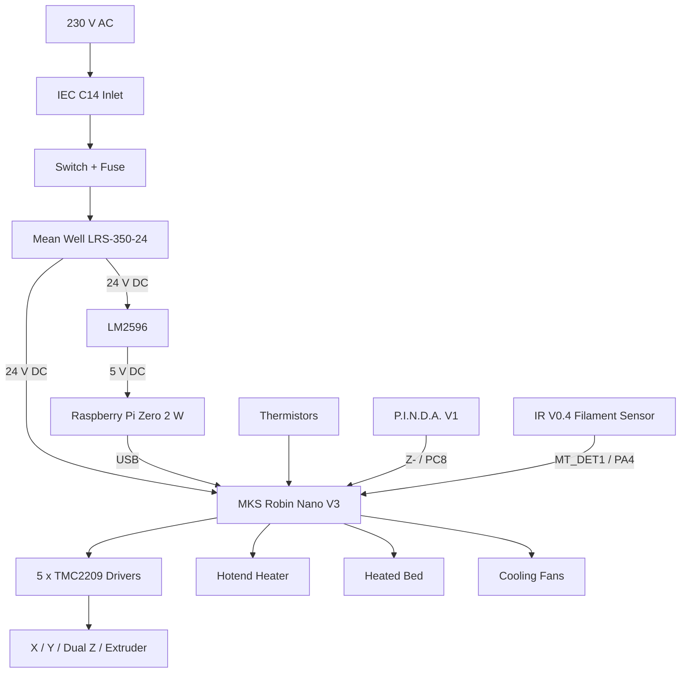

# Wiring & Electronics

See [Owner-Reported Hardware and Test Status](io-map.md#owner-reported-hardware-and-test-status) for the confirmed V3.0 hardware, connections and remaining checks.

This section documents the electrical architecture, wiring, controller configuration and hardware interfaces of the **My-Cloner Rev A**.

The My-Cloner Rev A uses a **24 V DC electrical system**, an **MKS Robin Nano V3** controller, **TMC2209 stepper drivers** and a **Raspberry Pi Zero 2 W** running Klipper and Mainsail.

!!! warning "Work in Progress"
    The My-Cloner Rev A is assembled. A clean Klipper installation and renewed commissioning are planned.

    Board-level information may already be confirmed while some My-Cloner-specific connections remain marked as pending validation.

    Items should only be marked as **Validated** after successful testing on the physical machine.

---

## Electrical Architecture

The main power and control architecture is:

---

## Documentation

-   :material-electric-switch:{ .lg .middle } **System Overview**

    ---

    Understand the complete My-Cloner Rev A electrical architecture and how the main subsystems work together.

    [:octicons-arrow-right-24: System Overview](system-overview.md)

-   :material-power-plug:{ .lg .middle } **Power Distribution**

    ---

    AC input, IEC inlet, Mean Well power supply, 24 V distribution and the 5 V Raspberry Pi supply.

    [:octicons-arrow-right-24: Power Distribution](power-distribution.md)

-   :material-expansion-card:{ .lg .middle } **Controller Board**

    ---

    MKS Robin Nano V3 hardware, STM32F407 MCU, driver interfaces, heaters, sensors, fans and auxiliary connections.

    [:octicons-arrow-right-24: Controller Board](controller-board.md)

-   :material-connection:{ .lg .middle } **I/O Map**

    ---

    The central mapping between physical devices, board connections, MCU pins, Klipper sections and validation status.

    [:octicons-arrow-right-24: I/O Map](io-map.md)

-   :material-step-forward:{ .lg .middle } **Motors & Homing**

    ---

    TMC2209 drivers, five stepper motors, dual Z architecture, UART and X/Y sensorless homing.

    [:octicons-arrow-right-24: Motors & Homing](motors-and-homing.md)

-   :material-thermometer:{ .lg .middle } **Heaters & Temperature Sensors**

    ---

    Hotend and bed heaters, thermistors, thermal protection, PID calibration and temperature validation.

    [:octicons-arrow-right-24: Heaters & Temperature Sensors](heaters-and-temperature-sensors.md)

-   :material-fan:{ .lg .middle } **Fans**

    ---

    4010 hotend cooling, 5015 part-cooling, Robin Nano fan outputs and PWM validation.

    [:octicons-arrow-right-24: Fans](fans.md)

-   :material-monitor:{ .lg .middle } **Display & Filament Sensor**

    ---

    MKS TS35 V2.0 integration, EXP interfaces and the MK3-style IR filament sensor.

    [:octicons-arrow-right-24: Display & Filament Sensor](display-and-filament-sensor.md)

---

## Recommended Reading Order

For a first-time My-Cloner electrical build, follow the documentation in this order:

1. [System Overview](system-overview.md)
2. [Power Distribution](power-distribution.md)
3. [Controller Board](controller-board.md)
4. [I/O Map](io-map.md)
5. [Motors & Homing](motors-and-homing.md)
6. [Heaters & Temperature Sensors](heaters-and-temperature-sensors.md)
7. [Fans](fans.md)
8. [Display & Filament Sensor](display-and-filament-sensor.md)

The sequence follows the engineering workflow:

**understand → power → controller → map → motion → heating → cooling → auxiliary interfaces**

---

## Source of Truth

| Information | Authoritative Source |
|---|---|
| Mechanical design | Current My-Cloner CAD / prototype |
| Components | My-Cloner Rev A BOM V2 |
| Electrical wiring | Current My-Cloner electrical schematic |
| Board-level pin mapping | Official Makerbase MKS Robin Nano V3 documentation |
| Klipper board mapping | Official Klipper MKS Robin Nano V3 configuration |
| My-Cloner I/O assignments | [I/O Map](io-map.md) |
| Final firmware configuration | Planned My-Cloner Rev A `printer.cfg`; release pending physical validation |

!!! important "Documentation vs Validation"
    Official board documentation can confirm what a pin or connector does.

    It does not automatically validate how that resource is used by the My-Cloner.

    My-Cloner-specific assignments must be checked against the electrical schematic and validated on the physical Rev A machine.

---

## Current Bring-Up Status

Use the shared [Status Definitions](io-map.md#status-definitions), including `TBD` for an undecided value and `Pending validation` for an outstanding check.

The machine is assembled and previous tests were performed. No earlier printer.cfg is available; a clean Klipper/Mainsail installation and new configuration are planned. The remaining checks concern commissioning and calibration.

These include:

- P.I.N.D.A. PC8 input polarity, offsets and repeatability
- FAN1 / FAN2 control behaviour, PWM and airflow
- IR V0.4 sensor polarity and runout behaviour on MT_DET1 / PA4
- TMC2209 current values
- X/Y sensorless-homing thresholds
- Motor directions
- Bed thermistor curve and both temperature readings under the new configuration
- Heater operation under the new configuration
- PID calibration
- Thermal limits
- MKS TS35 V2.0 integration
- Final `printer.cfg`

These items will move from **Pending validation** to **Validated** during the Rev A bring-up process.

---

## Safety

!!! danger "Mains Voltage"
    The printer contains 230 V AC mains wiring.

    Disconnect the printer from the mains supply before opening or modifying the electrical system.

!!! warning "First Power-On"
    Do not attempt a complete printer power-on immediately after wiring.

    Validate the system in stages, beginning with the mains input and power supply before connecting sensitive electronics.

For the complete pre-power procedure:

[:octicons-arrow-right-24: Before First Power-On](../operation/initial-setup/before-first-power-on.md){ .md-button .md-button--primary }