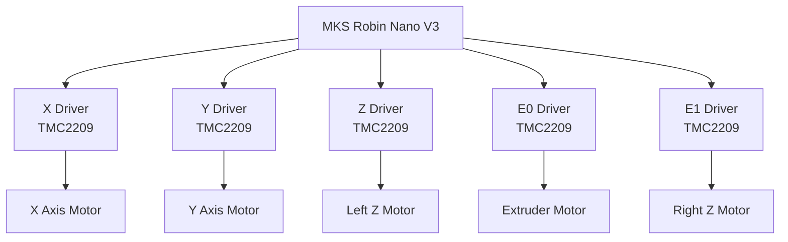
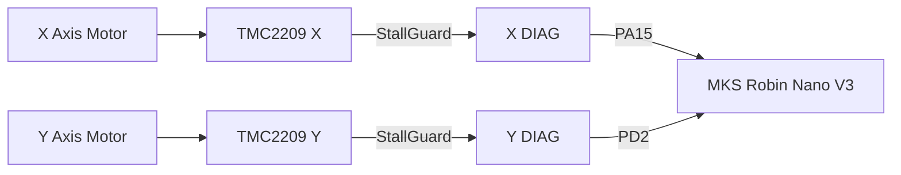
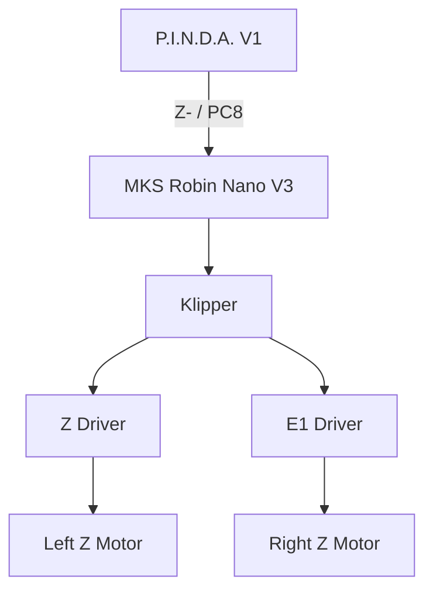

# My-Cloner Rev A — Motors & Homing

See [Owner-Reported Hardware and Test Status](io-map.md#owner-reported-hardware-and-test-status) for the confirmed V3.0 hardware, connections and remaining checks.

This page describes the stepper motor architecture, driver assignments and homing strategy used by the **My-Cloner Rev A**.

The printer uses:

- 5 × stepper motors
- 5 × TMC2209 stepper drivers
- UART communication
- Sensorless homing on X and Y
- P.I.N.D.A. V1 probe for Z reference

!!! warning "Physical Validation Required"
    Motor direction, current, sensorless-homing sensitivity and homing repeatability must be validated on the physical My-Cloner Rev A.

    Configuration values must not be considered final until the machine has completed the bring-up and validation process.

---

## Motor Architecture

The My-Cloner Rev A uses five stepper motors.

| Function | Motor Type | Board Driver | Klipper Section |
|---|---|---|---|
| X Axis | NEMA17 | X | `[stepper_x]` |
| Y Axis | NEMA17 | Y | `[stepper_y]` |
| Left Z Axis | NEMA17 | Z | `[stepper_z]` |
| Right Z Axis | NEMA17 | E1 | `[stepper_z1]` |
| Extruder | NEMA17 Pancake | E0 | `[extruder]` |

The Z axis uses two independent motors.

The current Rev A board assignment is:

**Z driver → left Z motor; E1 driver → right Z motor.**

This assignment will be physically validated during machine bring-up.



---

## Stepper Drivers

The My-Cloner Rev A uses:

**5 × TMC2209**

The drivers are intended to operate in:

**UART mode**

This allows Klipper to configure and monitor driver parameters directly.

The MKS Robin Nano V3 provides individual UART lines for each driver position.

| Driver | UART Pin |
|---|---:|
| X | `PD5` |
| Y | `PD7` |
| Z | `PD4` |
| E0 | `PD9` |
| E1 | `PD8` |

These assignments are documented in the My-Cloner [I/O Map](io-map.md).

### Driver Configuration

The final TMC2209 configuration will include parameters such as:

- UART pin
- Motor current
- Interpolation
- StealthChop / SpreadCycle behaviour where appropriate
- StallGuard configuration
- Sensorless-homing sensitivity

Example structure:

```ini
[tmc2209 stepper_x]
uart_pin: PD5
diag_pin: PA15
run_current: TBD
driver_SGTHRS: TBD
```

!!! warning "Do Not Copy Example Values"
    The UART and DIAG MCU pins are known from the MKS Robin Nano V3 board mapping.

    The final Klipper `diag_pin` configuration may require pull-up or signal inversion depending on the physical TMC2209 installation and DIAG behaviour.

    Motor current and StallGuard sensitivity depend on the actual motors and mechanical system and must be determined during physical testing.

---

## STEP / DIR / ENABLE Mapping

### X Axis

| Signal | MCU Pin |
|---|---:|
| STEP | `PE3` |
| DIR | `PE2` |
| ENABLE | `PE4` |
| UART | `PD5` |
| DIAG / Endstop | `PA15` |

The final direction polarity will be determined during motor testing.

### Y Axis

| Signal | MCU Pin |
|---|---:|
| STEP | `PE0` |
| DIR | `PB9` |
| ENABLE | `PE1` |
| UART | `PD7` |
| DIAG / Endstop | `PD2` |

The final direction polarity will be determined during motor testing.

### Left Z Axis

| Signal | MCU Pin |
|---|---:|
| STEP | `PB5` |
| DIR | `PB4` |
| ENABLE | `PB8` |
| UART | `PD4` |

The Left Z motor uses the board's standard Z driver position.

### Right Z Axis

| Signal | MCU Pin |
|---|---:|
| STEP | `PD15` |
| DIR | `PA1` |
| ENABLE | `PA3` |
| UART | `PD8` |

The Right Z motor uses the board's E1 driver position.

In Klipper this will be configured as:

    [stepper_z1]

!!! note "Independent Z Motors"
    The two Z motors are controlled independently by Klipper.

    This allows separate motor control while still operating as one Z axis.

### Extruder

| Signal | MCU Pin |
|---|---:|
| STEP | `PD6` |
| DIR | `PD3` |
| ENABLE | `PB3` |
| UART | `PD9` |

The extruder uses the E0 driver position.

---

## X and Y Sensorless Homing

The My-Cloner Rev A does not use physical X or Y endstop switches.

Instead, the Rev A architecture uses:

**TMC2209 sensorless homing**

Sensorless homing detects the mechanical end of travel using the driver's StallGuard functionality.

The sensorless-homing architecture is defined for Rev A, but the final driver current, StallGuard sensitivity, homing speed and repeatability must be determined during physical bring-up.

The MKS Robin Nano V3 routes the TMC2209 DIAG signals to the endstop inputs.

| Axis | DIAG / Endstop | MCU Pin |
|---|---|---:|
| X | X- | `PA15` |
| Y | Y- | `PD2` |



### Sensorless Homing Parameters

Sensorless homing requires physical tuning.

The main variables include:

- Motor current
- `driver_SGTHRS`
- Homing speed
- Belt tension
- Mechanical friction
- Axis mass
- Acceleration
- Homing direction

A configuration that works on another printer must not be assumed to work correctly on the My-Cloner.

!!! warning "Too Sensitive"
    If the StallGuard threshold is too sensitive, the axis may stop before reaching the mechanical end.

!!! warning "Not Sensitive Enough"
    If the threshold is not sensitive enough, the motor may continue pushing against the frame after reaching the mechanical end.

The value must therefore be tuned conservatively.

### Sensorless Homing Validation

The recommended validation process for each sensorless axis is:

1. Confirm free mechanical movement.
2. Verify motor direction at low speed.
3. Confirm TMC2209 UART communication.
4. Configure a conservative motor current.
5. Configure the DIAG pin.
6. Start with a conservative StallGuard threshold.
7. Test homing at low speed.
8. Adjust sensitivity gradually.
9. Repeat homing multiple times.
10. Confirm repeatability.

The final configuration should only be accepted when homing is reliable and repeatable.

---

## Homing Direction

The final X and Y homing directions must match the My-Cloner mechanical design.

The direction will be validated against:

- Axis geometry
- Motor direction
- Belt routing
- Coordinate system
- Printable-area origin

The Klipper `dir_pin` polarity may therefore require inversion during bring-up.

!!! note "Pin Inversion"
    In Klipper, the `!` prefix is used to invert a digital signal.

    Example:

    ```ini
    dir_pin: !PE2
    ```

    The required polarity must be determined from the actual motor movement.

---

## Z Homing

The Z axis does **not** use TMC sensorless homing.

The My-Cloner Rev A uses a:

**P.I.N.D.A. inductive probe**

The probe provides:

- Z reference
- Bed probing
- Bed-mesh measurements



The owner reports P.I.N.D.A. V1 on Z- / PC8, GND and 5 V, and confirms response to metal. Klipper trigger polarity, offsets and repeatability remain pending validation.

### Z Motor Behaviour

Both Z motors move together during normal operation.

Klipper will configure them as:

    [stepper_z]

and:

    [stepper_z1]

The P.I.N.D.A. probe provides the Z reference used by the Z axis.

!!! important "Z Motor Direction"
    Both Z motors must move the gantry in the same physical direction.

    Depending on motor orientation and wiring, one motor may require reversed direction.

    Verify both motors independently before performing normal Z moves.

---

## Motor Direction Validation

Before homing any axis:

1. Position the carriage away from the mechanical end.
2. Command a small positive move.
3. Observe the physical direction.
4. Stop immediately if the direction is incorrect.
5. Correct the Klipper direction polarity or motor wiring.
6. Repeat with a small move.
7. Validate each motor independently.

For the Z axis, test Left Z and Right Z independently before operating them together.

---

## Motor Current

The four axis motors are 17HS13-0404S1, rated 0.4 A per phase by the manufacturer. The extruder motor is 17HS10-0704S, rated 0.7 A per phase. These ratings are not final Klipper run_current settings; operating currents remain pending selection and testing.

Motor current must be selected according to:

- Motor rated current
- Driver cooling
- Mechanical load
- Required torque
- Operating temperature
- Reliability

The final current values will be recorded after physical validation.

| Motor | `run_current` | Status |
|---|---:|---|
| X | TBD | Pending validation |
| Y | TBD | Pending validation |
| Left Z | TBD | Pending validation |
| Right Z | TBD | Pending validation |
| Extruder | TBD | Pending validation |

---

## Microstepping

The generic MKS Robin Nano V3 Klipper configuration uses:

    microsteps: 16

This is a suitable starting point for the Rev A configuration.

The final configuration must remain consistent with:

- TMC2209 settings
- Pulley geometry
- Belt pitch
- Lead-screw geometry
- Extruder geometry

---

## Mechanical Transmission

### X and Y

The [mechanical BOM](../bom/mechanical-parts.md) specifies GT2 belts and 20-tooth pulleys, confirmed by the owner. With 2 mm belt pitch, the nominal travel is 40 mm per pulley revolution. Verify actual motion during calibration.

### Z

The installed lead screws have 2 mm pitch and 8 mm lead. Nominal Z travel is 8 mm per revolution; use the lead, not the thread pitch, when deriving rotation_distance.

### Extruder

The owner confirms direct motor-to-drive-gear operation without reduction. Extruder `rotation_distance` must still be calibrated physically; do not assume a geared extruder ratio.

The generic Klipper value must not be treated as the final My-Cloner value.

---

## Bring-Up Sequence

The recommended motor bring-up sequence is:

1. Validate controller power.
2. Validate USB / MCU communication.
3. Confirm TMC2209 UART communication.
4. Test X motor direction.
5. Test Y motor direction.
6. Test Left Z motor direction.
7. Test Right Z motor direction.
8. Test extruder motor direction.
9. Configure motor currents.
10. Configure X sensorless homing.
11. Configure Y sensorless homing.
12. Validate P.I.N.D.A. input.
13. Validate Z homing.
14. Test repeated homing cycles.

Do not attempt a full automatic homing sequence until each subsystem has been tested individually.

---

## Validation Status

See [Status Definitions](io-map.md#status-definitions). Design assignments and source mappings do not establish physical validation.

| Item | Status |
|---|---|
| X motor board mapping | Source confirmed |
| Y motor board mapping | Source confirmed |
| Left Z board mapping | Source confirmed |
| E0 / Extruder mapping | Source confirmed |
| E1 / Right Z mapping | Rev A assignment |
| TMC2209 UART pins | Source confirmed |
| X sensorless architecture | Rev A assignment |
| Y sensorless architecture | Rev A assignment |
| Z homing architecture | Rev A assignment — P.I.N.D.A. |
| Motor directions | Pending validation |
| Motor currents | Pending validation |
| X StallGuard threshold | Pending validation |
| Y StallGuard threshold | Pending validation |
| Homing speeds | Pending validation |
| Homing repeatability | Pending validation |
| Z motor synchronization | Pending validation |
| Extruder rotation distance | Pending validation |

---

## Related Documentation

- [I/O Map](io-map.md) — complete motor, UART, DIAG and probe mapping
- [Controller Board](controller-board.md) — MKS Robin Nano V3 driver and endstop interfaces
- [Heaters & Temperature Sensors](heaters-and-temperature-sensors.md) — P.I.N.D.A. context and thermal-system documentation
- [Firmware Configuration](../downloads/firmware-configuration.md) — planned Klipper motor and homing configuration