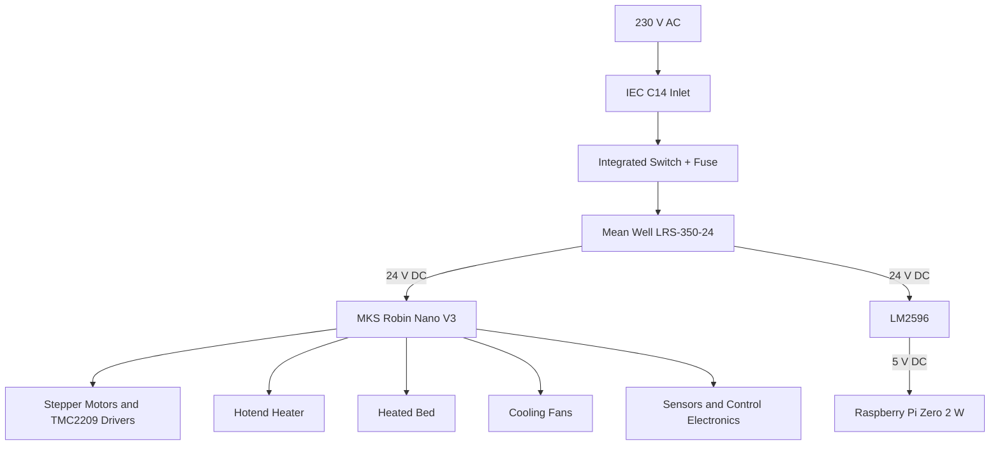
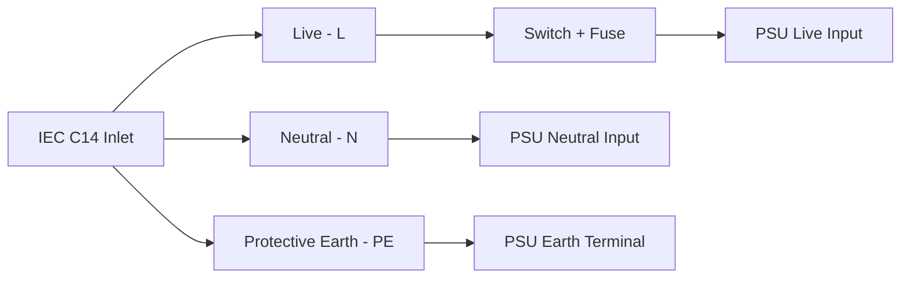
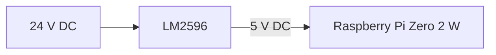
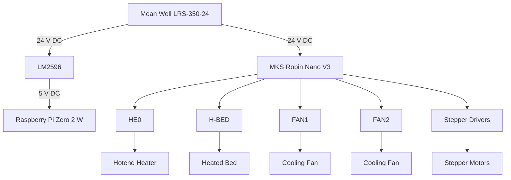

# My-Cloner Rev A — Power Distribution

This page describes the power architecture used by the **My-Cloner Rev A**.

The printer uses:

- **230 V AC mains input**
- **24 V DC main power**
- **5 V DC auxiliary power for the Raspberry Pi**

!!! danger "Mains Voltage"
    The AC input section of the printer operates at hazardous mains voltage.

    Disconnect the printer from the power outlet before working on the AC wiring.

    If you are not familiar with mains wiring and protective-earth practices, seek assistance from a qualified person.

---

## Power Architecture

The My-Cloner Rev A uses the following power path:

---

## AC Input

### IEC C14 Inlet

The My-Cloner Rev A uses an **IEC C14 mains inlet with integrated switch and fuse**.

The AC input section provides:

- Mains connection
- Main power switch
- Overcurrent protection through the fuse
- Protective-earth connection

The intended mains supply is:

**230 V AC**

!!! warning "Voltage Selection"
    The Mean Well LRS-350-24 supports selectable input-voltage ranges.

    Before connecting the printer to mains power, verify that the power supply input selector is set correctly for the local mains voltage.

    For the standard My-Cloner Rev A configuration described here, the intended input is **230 V AC**.

---

### AC Connections

The basic AC wiring is:

The switched and fused live conductor supplies the power supply.

The neutral conductor connects directly to the power supply neutral input.

Protective earth must be connected to the power supply earth terminal and to any exposed conductive parts that require protective grounding.

!!! danger "Protective Earth"
    Protective earth is a safety connection and must not be omitted.

    Do not use the DC negative conductor as a substitute for protective earth.

---

## Main Power Supply

The My-Cloner Rev A uses:

**Mean Well LRS-350-24**

| Parameter | Value |
|---|---|
| Output voltage | 24 V DC |
| Maximum output current | 14.6 A |
| Rated output power | 350.4 W |
| Intended AC input | 230 V AC |

The power supply provides the main 24 V DC rail for the printer.

---

### 24 V Distribution

The 24 V rail supplies the main printer systems.

| Load | Voltage |
|---|---:|
| MKS Robin Nano V3 | 24 V DC |
| Stepper motors / drivers | 24 V DC |
| Heated bed | 24 V DC |
| Hotend heater | 24 V DC |
| 4010 hotend fan | 24 V DC |
| 5015 part-cooling fan | 24 V DC |
| LM2596 converter | 24 V DC input |

The final current consumption of each branch will be validated during the Rev A bring-up process.

---

## Raspberry Pi Power

The Raspberry Pi Zero 2 W is powered through a dedicated DC-DC converter.

The converter used by the My-Cloner Rev A is:

**LM2596 step-down converter**

Its function is:

!!! danger "Adjust Before Connecting"
    Do not connect the Raspberry Pi until the LM2596 output voltage has been measured and adjusted correctly.

    Verify the output with a multimeter before connecting the Raspberry Pi.

The target output is:

**5 V DC**

---

### Raspberry Pi Ground Reference

The Raspberry Pi 5 V supply and the printer controller must share the appropriate DC ground reference for reliable communication.

The final grounding arrangement must follow the My-Cloner electrical schematic.

---

## Controller Power

The MKS Robin Nano V3 receives power from the main 24 V DC supply.

The board distributes power internally to:

- Stepper drivers
- Heater outputs
- Fan outputs
- Logic circuits
- Sensor interfaces

The My-Cloner Rev A does not use the Robin Nano V3 as the primary 5 V power source for the Raspberry Pi.

The Raspberry Pi uses the dedicated LM2596 converter instead.

---

## Heater Power

### Hotend Heater

The hotend heater is powered from the 24 V system and controlled by the Robin Nano V3.

| Item | Value |
|---|---|
| Heater type | V6-style cartridge |
| Voltage | 24 V DC |
| Controller output | HE0 |
| MCU control pin | `PE5` |
| Heater power | TBD |

The heater is switched by the controller board MOSFET.

---

### Heated Bed

The heated bed is also powered from the 24 V rail.

| Item | Value |
|---|---|
| Bed size | 230 × 230 mm |
| Voltage | 24 V DC |
| Controller output | H-BED |
| MCU control pin | `PA0` |
| Heater power | TBD |

!!! warning "High Current Load"
    The heated bed is one of the highest-current loads in the printer.

    Use suitable wire gauge, connectors and terminal preparation for the expected current.

---

## Fan Power

The My-Cloner Rev A uses 24 V fans.

| Fan | Voltage | Function |
|---|---:|---|
| 4010 Axial Fan | 24 V DC | Hotend heatsink cooling |
| 5015 Blower | 24 V DC | Part cooling |

The final FAN1 / FAN2 assignment on the Robin Nano V3 is still pending validation.

!!! warning "Do Not Use Legacy 12 V Fans"
    Earlier My-Cloner documentation referenced 12 V fans.

    Those references are obsolete for Rev A.

    The current My-Cloner Rev A uses **24 V fans**.

---

## DC Ground

All low-voltage systems must use a consistent DC ground reference.

The 24 V negative rail is shared by the controller and the LM2596 input.

The LM2596 output provides the 5 V supply and ground for the Raspberry Pi.

The final wiring arrangement must ensure that:

- DC return paths are correctly sized
- Ground connections are secure
- High-current loads do not share weak connections with sensitive electronics
- Protective earth remains separate from normal DC return wiring except where specifically required by the approved electrical design

---

## Recommended Distribution Layout

The preferred architecture is:

---

## Wire and Connector Requirements

Wire size must be selected according to:

- Maximum expected current
- Cable length
- Connector rating
- Ambient temperature
- Mechanical protection
- Applicable electrical standards

Particular attention should be given to:

- AC mains wiring
- Heated bed wiring
- PSU output wiring
- Controller power input
- Heater connections

!!! warning "Terminal Preparation"
    Do not place loose stranded wire directly under high-current screw terminals.

    Use appropriate ferrules or other approved termination methods where required.

---

## Fuse Protection

The IEC inlet includes a fuse.

The final fuse rating must be selected according to:

- Printer maximum power
- Input voltage
- Power supply characteristics
- Applicable safety requirements

!!! warning "Fuse Rating Pending Final Validation"
    The exact recommended fuse rating for the My-Cloner Rev A must be confirmed before release.

    Do not replace a fuse with a higher-current rating without verifying the electrical design.

---

## Power-On Validation

Before the controller, Raspberry Pi or heaters are connected, the power system should be validated in stages.

Recommended sequence:

1. Verify the IEC inlet wiring.
2. Verify protective earth continuity.
3. Confirm the PSU voltage-selector position.
4. Inspect all AC terminal connections.
5. Power the PSU without sensitive electronics connected where appropriate.
6. Measure the 24 V output.
7. Confirm correct polarity.
8. Connect the LM2596.
9. Adjust the LM2596 output to 5 V.
10. Verify the 5 V output with a multimeter.
11. Disconnect mains power.
12. Connect the controller and Raspberry Pi only after the voltages are confirmed.

!!! danger "Power Off Before Rewiring"
    Always disconnect mains power before changing wiring or moving connections.

---

## Validation Status

| Item | Status |
|---|---|
| IEC C14 inlet | Defined |
| 230 V AC architecture | Defined |
| Mean Well LRS-350-24 | Defined |
| 24 V main rail | Defined |
| LM2596 24 V → 5 V | Defined |
| Raspberry Pi Zero 2 W supply | Defined |
| Hotend heater power | TBD |
| Heated bed power | TBD |
| Final fuse rating | Pending validation |
| Wire gauges | Pending validation |
| Final grounding layout | Pending schematic validation |
| Physical power-on test | Pending |

---

## Related Documentation

For the complete electrical architecture:

[System Overview](system-overview.md)

For controller connections:

[Controller Board](controller-board.md)

For the complete signal mapping:

[I/O Map](io-map.md)

For heater wiring:

[Heaters & Temperature Sensors](heaters-and-temperature-sensors.md)

For first power-on checks:

[Before First Power-On](../operation/initial-setup/before-first-power-on.md)