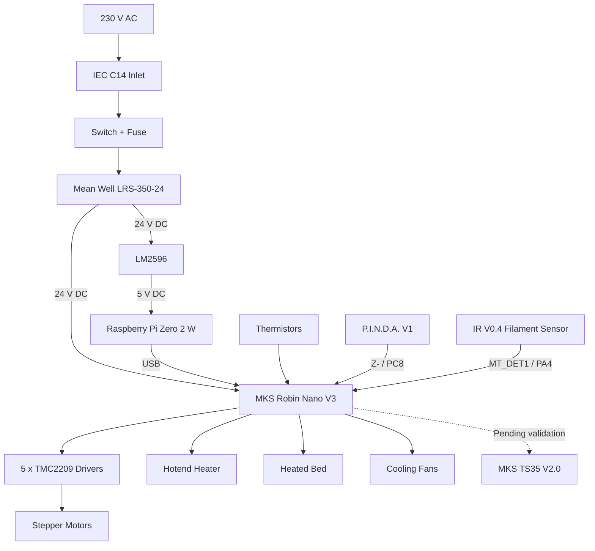

# My-Cloner Rev A — Electrical System Overview

See [Owner-Reported Hardware and Test Status](io-map.md#owner-reported-hardware-and-test-status) for the confirmed V3.0 hardware, connections and remaining checks.

This page provides a high-level overview of the electrical architecture used by the **My-Cloner Rev A**.

The goal is to show how the main electrical subsystems are connected before moving into the detailed wiring pages.

---

## System Architecture

The My-Cloner Rev A uses a **24 V DC electrical architecture**.

The main electrical path is:

## Main Electrical Subsystems

The My-Cloner Rev A electrical system is divided into the following main subsystems:

| Subsystem | Main Components | Purpose |
|---|---|---|
| AC Input | IEC C14 inlet, switch, fuse | Connects the printer to 230 V AC mains |
| DC Power Supply | Mean Well LRS-350-24 | Converts 230 V AC to 24 V DC |
| Main Controller | MKS Robin Nano V3 | Controls printer hardware |
| Klipper Host | Raspberry Pi Zero 2 W | Runs Klipper host software and Mainsail |
| 5 V Supply | LM2596 | Converts 24 V DC to 5 V DC for the Raspberry Pi |
| Motion | 5 × NEMA17 motors + TMC2209 drivers | Controls X, Y, dual Z and extrusion |
| Heating | Hotend heater + heated bed | Provides extrusion and build-surface heating |
| Temperature Monitoring | Hotend and bed thermistors | Provides temperature feedback |
| Cooling | 4010 + 5015 fans | Hotend and part-cooling |
| Z Sensing | P.I.N.D.A. probe | Z reference and bed probing |
| Filament Detection | MK3-style IR sensor | Detects filament presence |
| Local Display | MKS TS35 V2.0 | Local interface — integration: Pending validation |
| Web Interface | Mainsail | Primary printer control interface |

---

## Power Domains

The My-Cloner uses two main DC voltage domains:

### 24 V DC

Used by:

- MKS Robin Nano V3
- Heated bed
- Hotend heater
- 4010 hotend fan
- 5015 part-cooling fan
- Stepper motors / drivers

### 5 V DC

Used by:

- Raspberry Pi Zero 2 W

The 5 V supply is generated by an LM2596 DC-DC converter connected to the 24 V system.

!!! warning "Raspberry Pi Power"
    The Raspberry Pi must receive a stable 5 V supply.

    The LM2596 output voltage must be adjusted and verified before connecting the Raspberry Pi.

---

## Motion Architecture

The My-Cloner uses two main DC voltage domains:

| Function | Motor | Driver Position |
|---|---|---|
| X Axis | NEMA17 | X |
| Y Axis | NEMA17 | Y |
| Left Z Axis | NEMA17 | Z |
| Right Z Axis | NEMA17 | E1 |
| Extruder | NEMA17 Pancake | E0 |

All five positions use **TMC2209 stepper drivers in UART mode**.

The My-Cloner Rev A uses TMC2209 sensorless homing on the X and Y axes.

The sensorless-homing architecture is a Rev A assignment. Driver current, StallGuard sensitivity, homing speed and repeatability remain pending physical validation.

Z referencing is assigned to P.I.N.D.A. V1 on Z- / PC8. Trigger polarity, offsets and operation with the new configuration remain pending validation.

---

## Heating Architecture

The My-Cloner Rev A includes two heating systems:

| Heater | Voltage | Controller Output |
|---|---:|---|
| Hotend | 24 V DC | HE0 |
| Heated Bed | 24 V DC | H-BED |

Temperature feedback is provided by:

- Hotend thermistor
- Heated bed thermistor

The exact thermistor models must match the Klipper configuration.

---

## Cooling Architecture

The printer uses two 24 V cooling devices:

| Device | Function |
|---|---|
| 4010 Axial Fan | Hotend heatsink cooling |
| 5015 Blower | Part-cooling |

The owner reports FAN1 / PC14 for the 4010 hotend fan and FAN2 / PB1 for the 5015 part-cooling fan. Operation with the new configuration remains pending validation.

---

## Control Architecture

The My-Cloner uses Klipper with a separate host and MCU architecture.

The Raspberry Pi handles:

- Klipper host processing
- Mainsail web interface
- Network access
- High-level printer control

The MKS Robin Nano V3 handles:

- Step generation
- Heater control
- Fan control
- Sensor inputs
- Motor-driver communication
- Real-time hardware control

---

## User Interfaces

### Primary Interface

The primary user interface is:

**Mainsail**

Mainsail runs through the Raspberry Pi Zero 2 W and provides browser-based printer control.

### Local Display

The My-Cloner Rev A hardware includes an:

**MKS TS35 V2.0**

Its final integration with the Klipper-based architecture is pending validation.

---

## Sensors

The current Rev A sensor architecture includes:

| Sensor | Function | Status |
|---|---|---|
| P.I.N.D.A. V1 | Z probing / Z reference | Rev A assignment |
| Hotend Thermistor | ATC Semitec 104GT-2, owner-identified | Rev A assignment |
| Bed Thermistor | Original Ender 3 NTC 100 kΩ; exact curve TBD | Pending validation |
| IR Filament Sensor | Filament detection | Rev A assignment |
| X Sensorless Homing | X-axis homing | Rev A assignment |
| Y Sensorless Homing | Y-axis homing | Rev A assignment |

---

## Safety Architecture

The main electrical safety elements include:

- IEC C14 inlet
- Integrated mains switch
- Fuse
- Mean Well enclosed power supply
- Protective earth connection
- Klipper thermal protection
- Temperature monitoring
- Controlled heater outputs

!!! danger "Mains Voltage"
    The AC side of the printer operates at mains voltage.

    Disconnect the printer from the power outlet before working on mains wiring.

---

## Documentation Flow

Use the following pages for more detailed information:

1. [Power Distribution](power-distribution.md)
2. [Controller Board](controller-board.md)
3. [I/O Map](io-map.md)
4. [Motors & Homing](motors-and-homing.md)
5. [Heaters & Temperature Sensors](heaters-and-temperature-sensors.md)
6. [Fans](fans.md)
7. [Display & Filament Sensor](display-and-filament-sensor.md)

---

## Validation Status

See [Status Definitions](io-map.md#status-definitions). Design assignments and source mappings do not establish physical validation.

Some elements of this architecture are already defined at design level, while others still require physical validation.

The following items are still pending:

- P.I.N.D.A. PC8 input polarity, offsets and repeatability
- FAN1 / FAN2 control behaviour, PWM and airflow
- IR V0.4 sensor polarity and runout behaviour on MT_DET1 / PA4
- TMC2209 current values
- X/Y sensorless homing thresholds
- Motor direction and polarity
- Bed thermistor curve and both temperature readings under the new configuration
- MKS TS35 V2.0 Klipper integration

These items will be updated during the My-Cloner Rev A bring-up process.