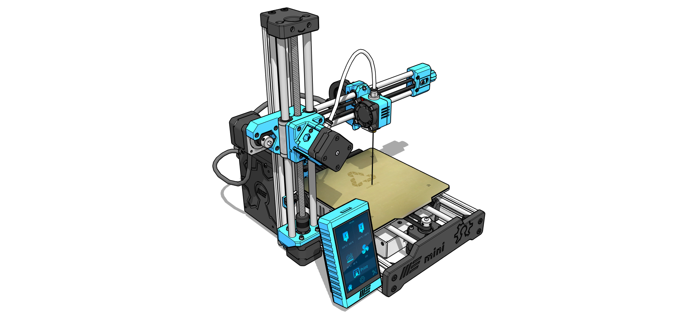

# Welcome to My Mini 3D Printer Documentation
<figure markdown="span">
  { width="1000" }
  <figcaption></figcaption>
</figure>

## Welcome to the official documentation for the MY-Mini 3D Printer.
Here you will find all the information you need to set up, use, and troubleshoot your 3D printer.

-   :fontawesome-solid-book-open:{ .lg .middle } __Instruction Manual__

    ---

    In this section you will find everything you need about MY-Mini manuals as well as how to download them.

    [:octicons-arrow-right-24: Find out more](manual/index.md)

-   :fontawesome-solid-screwdriver-wrench:{ .lg .middle } __Help with maintenance__

    ---

    If you need information on how to do any type of maintenance on your MY-Mini, then this is the place.

    [:octicons-arrow-right-24: Find out more](maintenance/index.md)

-   :fontawesome-brands-app-store:{ .lg .middle } __Help with Slicer Software__

    ---

    From the first steps with Slicer, to advanced help, here you will find several articles to help you learn about the software.

    [:octicons-arrow-right-24: Find out more](slicer/index.md)

-   :fontawesome-solid-triangle-exclamation:{ .lg .middle } __Troubleshooting__

    ---

    Do you have any problems with your machine? Find here some simple solutions that can help you a lot.

    [:octicons-arrow-right-24: Find out more](troubleshooting/index.md)

-   :fontawesome-solid-helmet-safety:{ .lg .middle } __Help with safety__

    ---

    Better safe than sorry, everything you need to know about how to work safely with your MY-Mini.

    [:octicons-arrow-right-24: Find out more](safety/index.md)

-   :fontawesome-solid-wand-magic-sparkles:{ .lg .middle } __Learning with tips and tricks__

    ---

    Want to learn just a little more? So here it is...

    [:octicons-arrow-right-24: Find out more](tips-and-tricks/index.md)

## Didn't find what you were looking for?

Please contact us directly, we are here to help.

  <a href="https://api.whatsapp.com/send?1=pt_pt&phone=351924244819" class="md-button" style="width: 200px; height: 54px;">
    Whatsapp <i class="fab fa-whatsapp" style="vertical-align: middle;"></i>
  </a>
  <a href="mailto:support@my-machines.net" class="md-button" style="width: 200px; height: 54px;">
    E-mail <i class="fas fa-paper-plane" style="vertical-align: middle;"></i>
  </a>

---

<!-- Para que os grid cards funcionem corretamente, certifique-se que as extensões pymdownx estão ativas no mkdocs.yml -->
