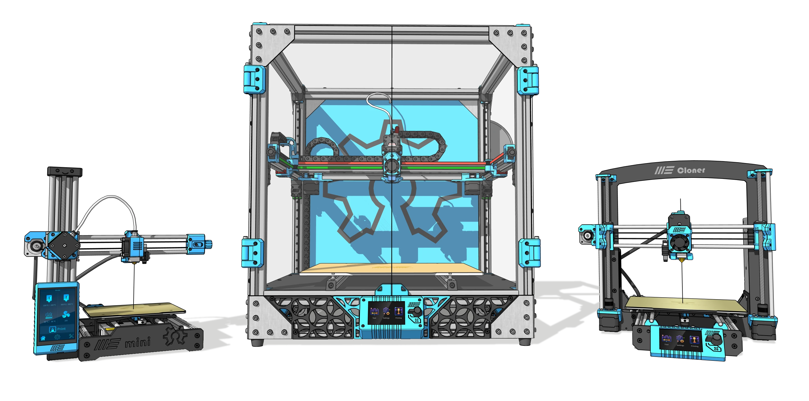

# Welcome to My Machines Knowledge Hub 

Empowering the maker community with **open-source digital fabrication**. Here you will find comprehensive assembly manuals, strictly organized Bill of Materials (BOMs), and high-level educational resources. We believe that building your own industrial-grade equipment should be a seamless, frustration-free experience.

Build, modify, learn, and share. **Welcome to your new desktop factory.**

## Choose Your Machine

Explore our open-source fabrication ecosystems. Each machine includes detailed DIY kits instructions, firmware configurations, and maintenance guides.

---

### 3D Printers

Discover our lineup of open-source 3D printers, built for uncompromising precision and scalability. From compact desktop units for beginners to massive large-format industrial workhorses, dive into detailed BOMs, Klipper configurations, and step-by-step assembly guides designed for the true DIY maker.

-   **[My-CoreXY](3d-printers/my-corexy/index.md)**

    ---
    High-speed, precision-driven CoreXY architecture.
    
-   **[My-Cloner](3d-printers/my-cloner/index.md)**

    ---
    The accessible Cartesian workhorse for rapid prototyping.

-   **[My-Giga1M3](3d-printers/my-giga1m3/index.md)**

    ---
    Massive 1-cubic-meter build volume for large-scale projects.

-   **[My-Delta](3d-printers/my-delta/index.md)**

    ---
    Blistering speed and tall prints in a vertical form factor.

-   **[My-Mini](3d-printers/my-mini/index.md)**

    ---
    Compact, open-source inspired powerhouse for smaller workspaces.

---

### Laser Machines

Step into advanced digital fabrication with our laser cutting and engraving systems. Whether you are cutting rigid materials with a CO2 laser, marking metals with Fiber technology, or starting out with a Diode setup, our documentation ensures a safe, reliable, and highly accurate workspace.

-   **[My-CO2 Laser](laser-machines/my-co2laser/index.md)**

    ---
    Industrial cutting power for wood, acrylic, and non-metals.

-   **[My-Fiber Laser](laser-machines/my-fiberlaser/index.md)**

    ---
    High-speed precision engraving for metallic parts.

-   **[My-Laser (Diode)](laser-machines/my-laser/index.md)**

    ---
    Versatile and accessible entry point for DIY laser projects.

---

### CNC Routers

Bring accessible subtractive manufacturing to your workshop. Our robust desktop CNC routers are engineered to handle everything from intricate custom PCB milling to heavy-duty wood and aluminum routing, complete with open-source control software guidelines.

-   **[My-Router XL](cnc-routers/my-router-xl/index.md)**

    ---
    Large-format routing for furniture and heavy sheet materials.

-   **[My-Router CNC](cnc-routers/my-router-cnc/index.md)**

    ---
    The standard desktop powerhouse for aluminum and hardwoods.

-   **[My-PCB Mill](cnc-routers/my-pcb-mill/index.md)**

    ---
    High-precision milling for custom electronic circuit boards.

---

### :fontawesome-solid-microchip: Other Maker Projects

Expand your desktop factory with innovative hardware add-ons and DIY upgrades. Dive into experimental builds, smart workshop tools, and custom mods designed by and for the maker community to elevate your entire fabrication ecosystem.

-   **[Filament Extruder](other-projects/my-filament-extruder/index.md)**

    ---
    Recycle and create your own custom 3D printing filament.

-   **[Injection Molding](other-projects/my-injection-molding/index.md)**

    ---
    Desktop-scale injection molding for small batch production.

-   **[MMU Addon](other-projects/my-mmu-addon/index.md)**

    ---
    Multi-material capabilities for complex, multi-color prints.

---

## Maker Education

We don't just provide hardware; we teach the engineering behind it. Dive into our pedagogical modules designed to transform hobbyists into skilled digital fabricators.

-   :fontawesome-solid-compass-drafting: **[CAD Modeling Basics](education/index.md)**
    
    ---
    Master 3D modeling for digital fabrication. Compare industry standards like **SolidWorks** with accessible, community-driven platforms like **FreeCAD**. Learn Design for Manufacturing (DFM) and translate your ideas into physical parts.

---

> 🌍 **The Open Source Pledge:** Every project documented here is built on the foundation of shared knowledge. We centralize the community's best practices so you can focus on what matters most: creating incredible projects.