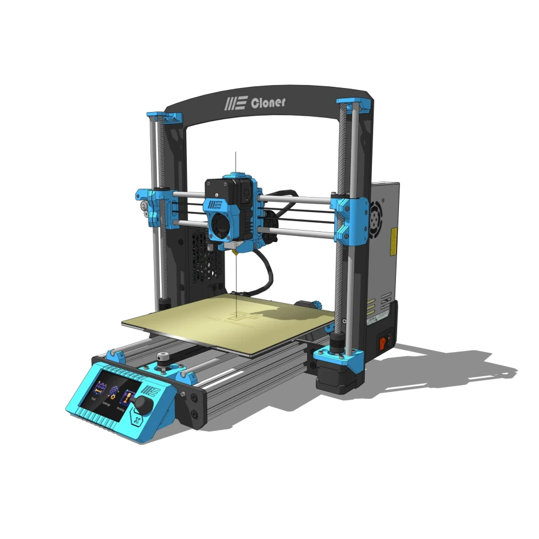
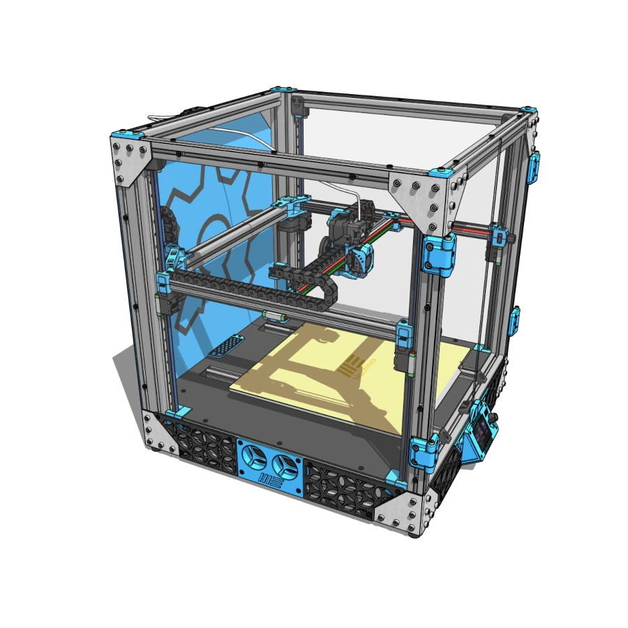
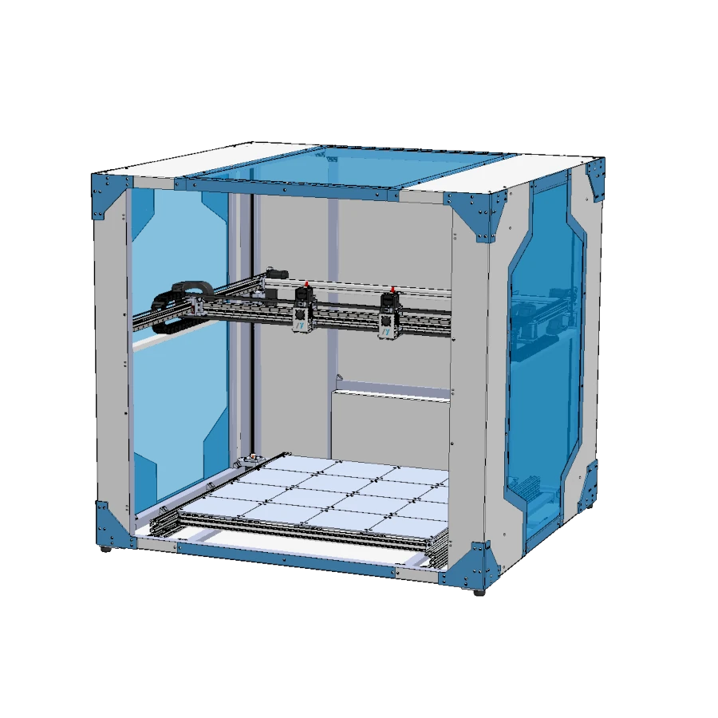
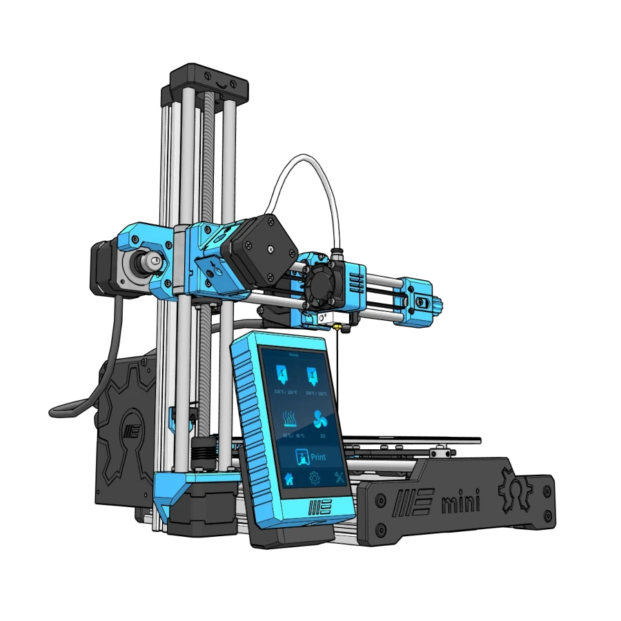

# Documentation Hub

Welcome to the **My Machines** documentation hub. Whether you are building your first DIY kit or upgrading a digital fabrication workshop, select your open-source machine below to access complete build guides, bill of materials (BOM), firmware configurations, and troubleshooting manuals.

## :material-printer-3d: My 3D printers
Precision-driven open-source 3D printers designed for rapid prototyping and reliable desktop manufacturing.

-   

    ---

    ### **My Cloner 3D Printer**
    The accessible Cartesian workhorse. A reliable and straightforward platform ideal for everyday maker education and rapid prototyping.

    - [:fontawesome-solid-book-open: Assembly Manual](other-machines/maquina1/assembly.md)
    - [:fontawesome-solid-gear: Documentation](other-machines/maquina1/index.md)

-   

    ---

    ### **My CoreXY 3D Printer**
    Delivers a robust CoreXY motion system for superior stability and speed. Perfect for makers demanding high precision and consistency.

    - [:fontawesome-solid-book-open: Assembly Manual](other-machines/maquina2/assembly.md)
    - [:fontawesome-solid-gear: Documentation](other-machines/maquina2/index.md)

-   

    ---

    ### **My Giga 1m3 3D Printer**
    Offers a massive 1-cubic-meter build volume for large prototypes or batch DIY projects. Industrial scale meets user-friendly reliability.

    - [:fontawesome-solid-book-open: Assembly Manual](other-machines/maquina2/assembly.md)
    - [:fontawesome-solid-gear: Documentation](other-machines/maquina2/index.md)

-   

    ---

    ### **My Mini 3D Printer**
    A compact, open-source inspired powerhouse. Perfect for small workspaces, beginner maker education, or as a reliable secondary DIY machine.

    - [:fontawesome-solid-book-open: Assembly Manual](other-machines/maquina2/assembly.md)
    - [:fontawesome-solid-gear: Documentation](other-machines/maquina2/index.md)
    
-   

    ---

    ### **My Delta 3D Printer**
    Engineered for blistering speed and tall prints. This upcoming open-source design brings rapid, precise digital fabrication to your workspace.

    - [:fontawesome-solid-book-open: Assembly Manual](other-machines/maquina2/assembly.md)
    - [:fontawesome-solid-gear: Documentation](other-machines/maquina2/index.md)

## :material-laser-pointer: My Laser Cutters and Engravers
Versatile DIY laser cutters delivering industrial-grade precision for your digital fabrication projects.

## :material-cog: My CNC Machines
Robust desktop CNC routers built to bring accessible subtractive manufacturing to your maker workshop.

## :material-text-search: My Other Projects
Innovative open-source upgrades and smart hardware solutions to elevate your entire maker ecosystem.

---

**Need Help?**
If you are struggling with a build or need community support, check our troubleshooting sections or join the My Machines Maker community.